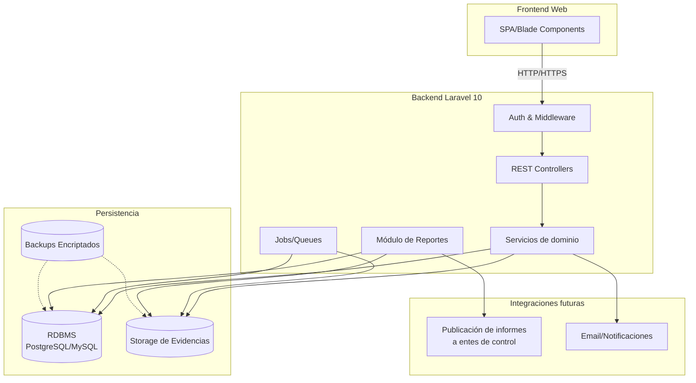
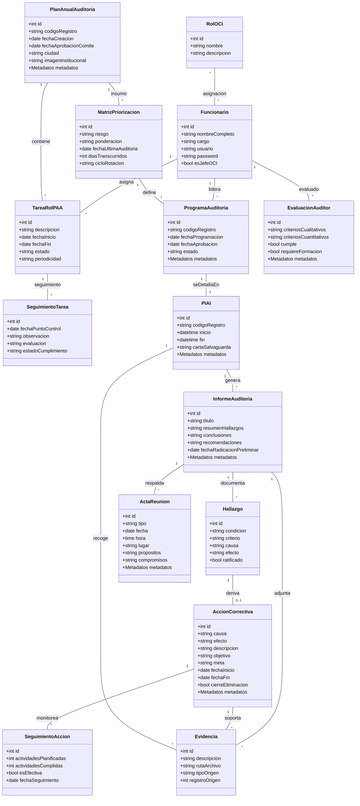

# Documento de Requerimientos del Sistema de Gestión de Auditoría Interna

## Tabla de contenido

- [1. Introducción y Contexto](#1-introducción-y-contexto)
  - [1.1 Objetivo del documento](#11-objetivo-del-documento)
  - [1.2 Alcance organizacional](#12-alcance-organizacional)
  - [1.3 Marco normativo de referencia](#13-marco-normativo-de-referencia)
  - [1.4 Roles clave y stakeholders](#14-roles-clave-y-stakeholders)
- [2. Visión General de la Solución](#2-visión-general-de-la-solución)
  - [2.1 Arquitectura funcional resumida](#21-arquitectura-funcional-resumida)
  - [2.2 Módulos principales](#22-módulos-principales)
  - [2.3 Flujo macro del proceso de auditoría](#23-flujo-macro-del-proceso-de-auditoría)
- [3. Requerimientos Funcionales (RF)](#3-requerimientos-funcionales-rf)
  - [3.1 RF-1: Módulo de parametrización](#31-rf-1-módulo-de-parametrización)
  - [3.2 RF-2: Plan anual de auditoría (PAA) y cumplimiento](#32-rf-2-plan-anual-de-auditoría-paa-y-cumplimiento)
  - [3.3 RF-3: Programa de auditoría interna](#33-rf-3-programa-de-auditoría-interna)
  - [3.4 RF-4: Plan individual y ejecución](#34-rf-4-plan-individual-y-ejecución)
  - [3.5 RF-5: Informes, controversias y acciones correctivas](#35-rf-5-informes-controversias-y-acciones-correctivas)
  - [3.6 RF-6: Competencias y evaluación del auditor](#36-rf-6-competencias-y-evaluación-del-auditor)
  - [3.7 RF-7: Documentación y repositorio](#37-rf-7-documentación-y-repositorio)
- [4. Requisitos de Seguridad, Confidencialidad y Ética](#4-requisitos-de-seguridad-confidencialidad-y-ética)
  - [4.1 Clasificación de protección y acceso](#41-clasificación-de-protección-y-acceso)
  - [4.2 Controles operativos en el flujo de auditoría](#42-controles-operativos-en-el-flujo-de-auditoría)
  - [4.3 Gestión de conflictos de interés y ética](#43-gestión-de-conflictos-de-interés-y-ética)
- [5. Gestión de Metadatos y Trazabilidad](#5-gestión-de-metadatos-y-trazabilidad)
  - [5.1 Principios generales](#51-principios-generales)
  - [5.2 Atributos obligatorios](#52-atributos-obligatorios)
  - [5.3 Aplicación a registros clave](#53-aplicación-a-registros-clave)
  - [5.4 Implicaciones técnicas para Laravel 10](#54-implicaciones-técnicas-para-laravel-10)
- [6. Modelo de Datos y Entidades](#6-modelo-de-datos-y-entidades)
  - [6.1 Consideraciones de modelado](#61-consideraciones-de-modelado)
  - [6.2 Entidades principales y atributos destacados](#62-entidades-principales-y-atributos-destacados)
  - [6.3 Tablas de catálogo y relaciones](#63-tablas-de-catálogo-y-relaciones)
  - [6.4 Diccionario de datos por dominio](#64-diccionario-de-datos-por-dominio)
- [7. Requerimientos No Funcionales (RNF)](#7-requerimientos-no-funcionales-rnf)
- [8. Consideraciones Tecnológicas para Laravel 10](#8-consideraciones-tecnológicas-para-laravel-10)
- [9. Funcionalidades por Rol de Usuario](#9-funcionalidades-por-rol-de-usuario)
- [10. Repositorio Documental y Contenido Obligatorio](#10-repositorio-documental-y-contenido-obligatorio)
- [11. Anexos y Referencias](#11-anexos-y-referencias)

## 1. Introducción y Contexto

### 1.1 Objetivo del documento

Definir de forma estructurada los requerimientos funcionales, no funcionales, de datos y de seguridad para modernizar la herramienta de gestión de auditoría interna (actualmente en Access) mediante una aplicación web desarrollada con Laravel 10.

### 1.2 Alcance organizacional

- Cobija los procesos de la Oficina de Control Interno (OCI) de entidades territoriales y nacionales (Rama Ejecutiva).
- Su alcance funcional es transversal a todos los procesos misionales, estratégicos, de apoyo y de evaluación y mejora de la entidad.
- Aplica a la planeación anual, ejecución de auditorías, seguimiento de hallazgos y acciones correctivas.

### 1.3 Marco normativo de referencia

- **Decreto 648 de 2017:** Define los cinco roles de la OCI, la organización del Comité Institucional de Coordinación de Control Interno y el enfoque de gestión.
- **NTC ISO 19011:2018:** Guías para auditorías de sistemas de gestión.
- **Guía de Auditoría Interna Basada en Riesgos (Función Pública, versión 4 - 2020).**
- **Documentación interna:** Procedimiento PD-GCA-004, manual MA-GCE-003, formatos FR-GCE-XXX y FR-GCA-XXX.

> **NOTA DE VALIDACIÓN (18/Sep/2025):** Este documento ha sido validado contra las fuentes normativas (Decreto 648/2017, PD-GCA-004, MA-GCE-003, Guía de Auditoría Interna Basada en Riesgos V4) por analista de software e ingeniero de sistemas. Se logró una **calificación de 9.3/10** en completitud profesional (ver ANALISIS_COMPLETITUD.md). Se realizó corrección crítica en RN-004: el plazo de 15 días hábiles para presentar el Plan de Mejoramiento inicia desde la **radicación del Informe Preliminar** (reunión de cierre), no del Informe Final, según lo establece el PD-GCA-004. Todos los demás requerimientos, roles, formatos y metadatos están correctamente capturados.

### 1.4 Roles clave y stakeholders

- **Jefe de Control Interno:** Responsable estratégico del programa de auditorías y del cierre de acciones.
- **Equipo auditor / profesional de apoyo:** Ejecuta actividades del PAA, diligencia PIAI, registra hallazgos y seguimientos.
- **Auditado / área auditada:** Presenta controversias, gestiona el plan de mejoramiento.
- **Secretaría de la OCI:** Resguardos documentales, radicación y archivo de evidencias.
- **Entes externos de control:** Reciben reportes y ejercen seguimiento.

## 2. Visión General de la Solución

### 2.1 Arquitectura funcional resumida

- Plataforma web MVC basada en Laravel 10.
- Integración de módulos de parametrización, planeación, ejecución, informes y seguimiento.
- Gestión centralizada de metadatos para los registros de calidad.

### 2.2 Módulos principales

1. **Parametrización y catálogos:** Funcionarios, roles OCI, entes de control, procesos, criterios, alcances, objetivos.
2. **Plan anual de auditoría (PAA):** Gestión de tareas por rol y seguimiento mediante puntos de control con evidencias.
3. **Priorización y programa de auditoría:** Universo de auditoría, matriz de riesgos, programa aprobado.
4. **Plan individual de auditoría (PIAI):** Planificación detallada, bitácora de actividades, control documental.
5. **Informes y controversias:** Informe preliminar, decisiones sobre controversias, informe final.
6. **Acciones correctivas:** Planes de mejora, seguimiento y cierre.
7. **Competencias del auditor:** Evaluación FR-GCA-005 y seguimiento a brechas.
8. **Repositorio documental:** Gestión de guías, procedimientos y formatos auxiliares.

### 2.3 Flujo macro del proceso de auditoría

1. Parametrización inicial de catálogos y roles.
2. Construcción del PAA y asignación de tareas por rol.
3. Priorización del universo auditado y definición del programa.
4. Elaboración del PIAI y ejecución en campo.
5. Generación de informe preliminar, gestión de controversias y emisión del informe final.
6. Registro y seguimiento de acciones correctivas hasta el cierre.
7. Evaluación de competencias del equipo auditor y actualización del repositorio documental.

## 3. Requerimientos Funcionales (RF)

### 3.1 RF-1 Módulo de parametrización


| Código | Descripción                                                                                                                     | Roles involucrados  |
| ------- | -------------------------------------------------------------------------------------------------------------------------------- | ------------------- |
| RF 1.1  | CRUD de funcionarios (Jefe CI, auditores, personal de apoyo), incluyendo usuario y credenciales de acceso.                       | Jefe Auditor, Apoyo |
| RF 1.2  | CRUD de los cinco roles de la OCI definidos en el Decreto 648 de 2017, con posibilidad de actualización si cambia la normativa. | Jefe Auditor, Apoyo |
| RF 1.3  | CRUD de entidades de control externas (Contraloría, Procuraduría, etc.).                                                       | Jefe Auditor, Apoyo |
| RF 1.4  | CRUD de procesos y áreas auditables (estratégicos, misionales, apoyo, evaluación y mejora).                                   | Jefe Auditor, Apoyo |
| RF 1.5  | CRUD de criterios de auditoría (normatividad, legislación, NTC) y alcances aplicables.                                         | Jefe Auditor, Apoyo |
| RF 1.6  | Cargue de imagen institucional y otros parámetros institucionales.                                                              | Jefe Auditor, Apoyo |
| RF 1.7  | Catálogo de municipios de Colombia: consulta de catálogo precargado de los 1,123 municipios organizados por departamento, con buscador de texto para configuración del PAA. | Jefe Auditor, Apoyo |

### 3.2 RF-2 Plan anual de auditoría (PAA) y cumplimiento


| Código | Descripción                                                                                                                                                      | Roles involucrados  |
| ------- | ----------------------------------------------------------------------------------------------------------------------------------------------------------------- | ------------------- |
| RF 2.1  | Creación de PAA con fecha de elaboración, responsable (Jefe CI) y ciudad/municipio.                                                                             | Jefe Auditor, Apoyo |
| RF 2.2  | Registro de tareas por cada rol OCI, con fechas planificadas y responsable asignado.                                                                              | Jefe Auditor, Apoyo |
| RF 2.3  | Registro de puntos de control por tarea, incluyendo observaciones, estado (realizado, pendiente, anulado), evaluación (bien, mal) y ente de control relacionado. | Jefe Auditor, Apoyo |
| RF 2.4  | Gestión de evidencias asociadas a los puntos de control (carga, descripción, visualización).                                                                   | Jefe Auditor, Apoyo |
| RF 2.5  | Cálculo de porcentaje de avance del PAA y visualización de resumen por rol.                                                                                     | Jefe Auditor        |
| RF 2.6  | Auditorías express: registro y gestión de auditorías internas express o especiales solicitadas por el Representante Legal o derivadas de eventualidades, con flujo simplificado de PIAI e informe. | Jefe Auditor, Apoyo |
| RF 2.7  | Función de Advertencia (FR-GCE-002): gestión del formato para formalizar avisos sobre peligro o riesgo inminente, con anexión de informe técnico y registro de aprobación/improcedencia del Comité ICCCI. | Jefe Auditor, Apoyo |
| RF 2.8  | Acompañamientos (FR-GCE-003): gestión del formato para registrar actividades de asesoría de la OCI (rol "Enfoque hacia la prevención"), con cronograma y evidencias. | Jefe Auditor, Apoyo |
| RF 2.9  | Actos de Corrupción (FR-GCE-004): gestión del formato para evidenciar denuncias de posibles actos de corrupción, con clasificación, entidad competente para investigación y estado del reporte. | Jefe Auditor        |

### 3.3 RF-3 Programa de auditoría interna


| Código | Descripción                                                                                                                                                                                         | Roles involucrados  |
| ------- | ---------------------------------------------------------------------------------------------------------------------------------------------------------------------------------------------------- | ------------------- |
| RF 3.1  | Matriz de priorización: selección de procesos/áreas, registro de nivel de riesgo, ponderación, requerimientos de comité y entes reguladores, fecha de última auditoría y días transcurridos. | Jefe Auditor, Apoyo |
| RF 3.2  | Determinación automática del ciclo de rotación según la criticidad del riesgo.                                                                                                                   | Jefe Auditor, Apoyo |
| RF 3.3  | Registro del programa de auditoría con objetivos, alcance, criterios, recursos, fechas de inicio/fin y responsable.                                                                                 | Jefe Auditor        |
| RF 3.4  | Validación de correspondencia entre áreas priorizadas y criterios/alcances específicos parametrizados.                                                                                            | Jefe Auditor, Apoyo |
| RF 3.5  | Registro de aprobación del programa por el Comité Institucional de Coordinación de Control Interno.                                                                                               | Jefe Auditor        |
| RF 3.6  | Visualización y exportación del formato del programa (FR-GCA-001).                                                                                                                                 | Jefe Auditor        |

### 3.4 RF-4 Plan individual y ejecución


| Código | Descripción                                                                                                                                            | Roles involucrados  |
| ------- | ------------------------------------------------------------------------------------------------------------------------------------------------------- | ------------------- |
| RF 4.1  | Traslado automático de objetivos, alcance y criterios del programa al PIAI (FR-GCA-002).                                                               | Jefe Auditor, Apoyo |
| RF 4.2  | Registro de actividades del PIAI con fecha, hora de inicio/fin, descripción, auditados y auditores.                                                    | Apoyo, Auditores    |
| RF 4.3  | Registro de reunión de apertura con confirmación de objetivos, alcance, criterios, métodos de muestreo, confidencialidad y canales de comunicación. | Jefe Auditor, Apoyo |
| RF 4.4  | Gestión digital de la Carta de Salvaguarda con adjunto y validación obligatoria.                                                                      | Auditado, Apoyo     |
| RF 4.5  | Registro de hallazgos preliminares durante la ejecución, vinculando evidencia, condición, criterio, causa y efecto.                                   | Auditores           |

### 3.5 RF-5 Informes, controversias y acciones correctivas


| Código | Descripción                                                                                                         | Roles involucrados                |
| ------- | -------------------------------------------------------------------------------------------------------------------- | --------------------------------- |
| RF 5.1  | Generación de informe preliminar y final (FR-GCA-004) con resumen de hallazgos, conclusiones y recomendaciones.     | Auditores, Jefe Auditor           |
| RF 5.2  | Registro de controversias por parte del auditado, con control del plazo (15 días hábiles) y decisión del auditor. | Auditado, Auditores, Jefe Auditor |
| RF 5.3  | Registro de hallazgos ratificados y su asociación al plan de mejoramiento.                                          | Jefe Auditor                      |
| RF 5.4  | Registro de acciones correctivas (FR-GCA-001) con causa, efecto, acción, objetivos, metas, fechas y responsable.    | Auditado, Apoyo                   |
| RF 5.5  | Seguimiento de acciones correctivas (actividades planificadas/cumplidas, efectividad, evidencias) y cierre formal.   | Jefe Auditor, Apoyo               |

### 3.6 RF-6 Competencias y evaluación del auditor


| Código | Descripción                                                                                                               | Roles involucrados     |
| ------- | -------------------------------------------------------------------------------------------------------------------------- | ---------------------- |
| RF 6.1  | Registro de criterios de competencia (educación, experiencia, habilidades, comportamiento) para auditores y líderes.     | Jefe Auditor           |
| RF 6.2  | Gestión del formato FR-GCA-005 para evaluar el desempeño del auditor, incluyendo criterios cualitativos y cuantitativos. | Jefe Auditor, Auditado |
| RF 6.3  | Registro de brechas de competencia y planes de formación o experiencia adicional.                                         | Jefe Auditor           |

### 3.7 RF-7 Documentación y repositorio


| Código | Descripción                                                                                                                                              | Roles involucrados  |
| ------- | --------------------------------------------------------------------------------------------------------------------------------------------------------- | ------------------- |
| RF 7.1  | Acceso a un repositorio documental para cargar, describir y consultar guías, procedimientos y formatos.                                                  | Jefe Auditor        |
| RF 7.2  | Indexación y filtrado por nombre, tipo de documento y versión.                                                                                          | Jefe Auditor, Apoyo |
| RF 7.3  | Visualización en línea o descarga controlada de los documentos de referencia.                                                                           | Jefe Auditor, Apoyo |
| RF 7.4  | Precarga o disponibilidad de documentos obligatorios: Guía de Auditoría Interna Basada en Riesgos, Procedimientos PD-GCA-004, formatos MA-GCE-003, etc. | Jefe Auditor        |

## 4. Requisitos de Seguridad, Confidencialidad y Ética

### 4.1 Clasificación de protección y acceso

- Todos los registros FR-GCE-XXX y FR-GCA-XXX deben clasificarse como **Protección “Controlado”**.
- La ubicación lógica de los registros debe identificarse como **“PC control interno”** (servidor controlado por la OCI, acceso restringido).
- Acceso restringido a usuarios con roles explícitos (Jefe OCI, Auditor Líder, Equipo Auditor, Secretaría, Auditados con permiso limitado).

### 4.2 Controles operativos en el flujo de auditoría

- Confirmación formal de compromisos de confidencialidad durante la reunión de apertura.
- Manejo discreto de información y evidencias durante la ejecución.
- Capacidad del líder de auditoría para restringir observadores si comprometen la independencia.
- Registro de la Carta de Salvaguarda como evidencia de la autenticidad y oportunidad de la información.

### 4.3 Gestión de conflictos de interés y ética

- Registro y aprobación de declaraciones de conflicto de intereses (Anexo B) para auditores.
- Restricción para que un auditor evalúe procesos donde haya tenido responsabilidad previa sin autorización.
- Reglas de negocio que impidan el uso de información para beneficio propio o de terceros.
- Promoción de la objetividad e independencia en los resultados y recomendaciones del informe.

## 5. Gestión de Metadatos y Trazabilidad

### 5.1 Principios generales

- Garantizar la validez probatoria y la integridad de los registros de calidad.
- Integrar metadatos en la capa de persistencia y en la lógica de negocio para todos los formatos oficiales.
- Aplicar de manera uniforme a registros de planeación, ejecución y seguimiento.

### 5.2 Atributos obligatorios

1. Versión del formato (V / Ver).
2. Fecha de aprobación del formato.
3. Medio de almacenamiento: “Medio magnético”.
4. Protección: “Controlado”.
5. Ubicación lógica: “PC control interno”.
6. Método de recuperación: “Por fecha”.
7. Responsable del archivo (Jefe OCI para FR-GCE-XXX, Secretaría para FR-GCA-XXX).
8. Permanencia: “Permanente”.
9. Disposición final: “Backups”.

### 5.3 Aplicación a registros clave

- **Planeación (FR-GCE-XXX):** Plan anual de auditorías (FR-GCE-001), Función de advertencia (FR-GCE-002), Acompañamientos (FR-GCE-003), Registro de posibles actos de corrupción (FR-GCE-004).
- **Ejecución y seguimiento (FR-GCA-XXX):** Programa de auditorías internas (FR-GCA-001), Plan individual (FR-GCA-002), Informe de auditoría (FR-GCA-004), Evaluación del auditor (FR-GCA-005), Acta de reunión (FR-GCA-006), Acciones correctivas y preventivas (FR-GCA-001 – reutilizado).

### 5.4 Implicaciones técnicas para Laravel 10

- Los metadatos deben incluirse en las migraciones y modelos Eloquent de los registros oficiales.
- Establecer eventos de aplicación para capturar automáticamente versión vigente y fecha de aprobación.
- Implementar estrategias de respaldo automatizado según la política “Backups”.
- Incorporar filtros de consulta por fecha para cumplir con el criterio “Recuperación por fecha”.

## 6. Modelo de Datos y Entidades

### 6.1 Consideraciones de modelado

- Mantener integridad referencial entre catálogos, transacciones y evidencias.
- Modelar relaciones uno-a-muchos (PAA → Tareas, Tarea → Seguimientos) y muchos-a-muchos (Programas ↔ Criterios).
- Incorporar claves externas y restricciones de unicidad donde aplique (usuarios, códigos de registro).

### 6.2 Entidades principales y atributos destacados


| Entidad                               | Propósito                                            | Atributos clave                                                                                                                                                                                                      |
| ------------------------------------- | ----------------------------------------------------- | -------------------------------------------------------------------------------------------------------------------------------------------------------------------------------------------------------------------- |
| Usuario / Funcionario                 | Gestiona acceso y responsabilidades del personal OCI. | `funcionario_id`, `nombre_completo`, `cargo_operativo`, `credencial_usuario`, `credencial_password`, asignación de roles OCI.                                                                                       |
| Entidad de control externa            | Parametriza entes reguladores externos.               | `ente_control_id`, `nombre`, indicadores de seguimiento.                                                                                                                                                             |
| Plan anual de auditoría (FR-GCE-001) | Contenedor de la planeación anual.                   | `paa_id`, `codigo_registro`, `fecha_creacion`, `jefe_oci_responsable_fk`, `ciudad_municipio`, `imagen_institucional_path` + metadatos.                                                                               |
| Tarea de rol PAA                      | Registra actividades por rol de la OCI.               | `tarea_id`, `paa_fk`, `rol_oci_fk`, `descripcion_tarea`, `fecha_inicio_planeada`, `fecha_fin_planeada`, `responsable_fk`, `estado_general`.                                                                          |
| Seguimiento de tarea                  | Controla puntos de seguimiento del PAA.               | `seguimiento_id`, `tarea_fk`, `fecha_punto_control`, `observacion`, `estado_cumplimiento`, `evaluacion_tarea`, `ente_control_fk`.                                                                                    |
| Matriz de priorización               | Calcula criticidad y rotación de auditorías.        | `priorizacion_id`, `proceso_area_fk`, `paa_fk`, `riesgos_identificados`, `ponderacion_calculada`, `fecha_ultima_auditoria`, `dias_transcurridos`, `ciclo_rotacion`.                                                  |
| Programa de auditoría (FR-GCA-001)   | Define auditorías aprobadas.                         | `programa_auditoria_id`, `area_auditar_fk`, `fecha_programacion`, `fecha_aprobacion`, `objetivos_programa`, `alcance_programa`, `criterios_aplicados`, `estado_auditoria` + metadatos.                               |
| Plan individual (FR-GCA-002)          | Bitácora detallada de ejecución.                    | `piai_id`, `programa_auditoria_fk`, `objetivos_trasladados`, `fecha_inicio_auditoria`, `fecha_fin_auditoria`, `carta_salvaguarda_path` + metadatos.                                                                  |
| Detalle de actividad PIAI             | Registra actividades específicas.                    | `detalle_actividad_id`, `piai_fk`, `fecha_actividad`, `hora_inicio`, `hora_fin`, `actividad_descripcion`, `nombre_auditados`, `nombre_auditores`.                                                                    |
| Informe de auditoría (FR-GCA-004)    | Consolidación de hallazgos y recomendaciones.        | `informe_id`, `piai_fk`, `titulo_auditoria`, `resumen_hallazgos`, `conclusiones`, `recomendaciones`, `destinatario_legal`, `fecha_radicacion_preliminar` + metadatos.                                                |
| Hallazgo                              | Detalle de hallazgos y controversias.                 | `hallazgo_id`, `informe_fk`, `descripcion_hallazgo`, `condicion_evidencia`, `criterios_aplicados`, `causa`, `consecuencias_efectos`, `hallazgo_ratificado`.                                                          |
| Controversia                          | Gestión de respuestas de auditados.                  | `controversia_id`, `hallazgo_fk`, `descripcion_controversia`, `auditor_decision`, `fecha_presentacion`.                                                                                                              |
| Acción correctiva (FR-GCA-001)       | Plan de mejora derivado de hallazgos.                 | `accion_correctiva_id`, `hallazgo_ratificado_fk`, `causa_mejora`, `accion_a_implementar`, `objetivo_accion`, `meta_descripcion`, `fecha_inicio_accion`, `fecha_fin_accion`, `cierre_eliminacion_causas` + metadatos. |
| Seguimiento de acción                | Medición de avance y efectividad de acciones.        | `seg_accion_id`, `accion_correctiva_fk`, `actividades_planificadas`, `actividades_cumplidas`, `efectividad_accion`, `fecha_seguimiento`, `evidencia_seguimiento_fk`.                                                 |
| Evaluación del auditor (FR-GCA-005)  | Valora competencias del equipo auditor.               | `evaluacion_id`, `auditor_fk`, `evaluador_fk`, `piai_fk`, `criterios_cualitativos`, `criterios_cuantitativos`, `cumplimiento_criterios`, `necesidad_formacion_adicional` + metadatos.                                |
| Acta de reunión (FR-GCA-006)         | Formaliza reuniones de apertura y cierre.             | `acta_id`, `piai_fk`, `tipo_reunion`, `fecha_reunion`, `hora_reunion`, `lugar_reunion`, `asistentes_lista`, `propositos_confirmados`, `compromisos_adquiridos` + metadatos.                                          |
| Documentación de referencia          | Repositorio de guías y procedimientos.               | `documento_ref_id`, `nombre_documento`, `tipo_documento`, `version`, `ruta_archivo`.                                                                                                                                 |
| Evidencia documental                  | Archivos adjuntos vinculados a registros.             | `evidencia_id`, `descripcion_informe`, `ruta_archivo`, `tipo_registro_origen`, `registro_origen_fk`.                                                                                                                 |

### 6.3 Tablas de catálogo y relaciones


| Tabla catálogo              | Descripción                                            | Campos clave                                         |
| ---------------------------- | ------------------------------------------------------- | ---------------------------------------------------- |
| `users` (Laravel)            | Usuarios del sistema.                                   | `id`, `name`, `email`, `password`, `rol_sistema_id`. |
| `cat_roles_ci`               | Roles OCI (5 roles Decreto 648).                        | `id`, `nombre_rol`, `descripcion`.                   |
| `cat_entidades_control`      | Entidades externas de control.                          | `id`, `nombre_entidad`.                              |
| `cat_procesos`               | Procesos estratégicos, misionales, apoyo, evaluación. | `id`, `nombre_proceso`, `tipo_proceso`.              |
| `cat_areas`                  | Áreas auditables por proceso.                          | `id`, `nombre_area`, `proceso_id`.                   |
| `cat_criterios_normatividad` | Normatividad aplicable.                                 | `id`, `descripcion`, `tipo_norma`.                   |
| `cat_alcances_auditoria`     | Alcances predefinidos.                                  | `id`, `descripcion_alcance`.                         |
| `cat_objetivos_programa`     | Objetivos generales del programa.                       | `id`, `descripcion_objetivo`.                        |

Relaciones destacadas:

- `funcionario_rol_oci`: tabla puente (funcionario ↔ rol_oci).
- `asignacion_criterio_area`: asociación entre áreas auditables y criterios/alcances parametrizados.
- `programa_criterios`: relación M:M entre programas de auditoría y criterios.

### 6.4 Diccionario de datos por dominio

#### 6.4.1 Gestión de usuarios y catálogos

- **FUNCIONARIO:** `funcionario_id (PK)`, `nombre_completo`, `cargo_operativo`, `credencial_usuario (Unique)`, `credencial_password`, `rol_jefe_oci (Boolean)`.
- **ROL_OCI:** `rol_oci_id (PK)`, `nombre_rol`, `descripcion`.
- **FUNCIONARIO_ROL_OCI:** `funcionario_rol_id (PK)`, `funcionario_fk (FK)`, `rol_oci_fk (FK)`.
- **ENTIDAD_CONTROL_EXTERNA:** `ente_control_id (PK)`, `nombre`.

#### 6.4.2 Planeación general (PAA)

- **PLAN_ANUAL_AUDITORIA (FR-GCE-001):** `paa_id (PK)`, `codigo_registro`, `fecha_creacion`, `fecha_aprobacion_comite`, `jefe_oci_responsable_fk (FK)`, `ciudad_municipio`, `imagen_institucional_path`, `version_formato`, `fecha_aprobacion_formato`, `medio_almacenamiento`, `proteccion`, `ubicacion`, `metodo_recuperacion`, `permanencia`, `disposicion_final`.
- **TAREA_ROL_PAA:** `tarea_id (PK)`, `paa_fk (FK)`, `rol_oci_fk (FK)`, `descripcion_tarea`, `fecha_inicio_planeada`, `fecha_fin_planeada`, `responsable_fk (FK)`, `estado_general`, `comentarios_periodicidad`.
- **SEGUIMIENTO_TAREA_PAA:** `seguimiento_id (PK)`, `tarea_fk (FK)`, `fecha_punto_control`, `observacion`, `estado_cumplimiento`, `evaluacion_tarea`, `ente_control_fk (FK)`.

#### 6.4.3 Priorización y programación

- **PROCESO_AREA_AUDITABLE:** `proceso_area_id (PK)`, `nombre_area`, `tipo_proceso`.
- **CRITERIO_ALCANCE_PARAM:** `criterio_alcance_id (PK)`, `tipo`, `descripcion`.
- **ASIGNACION_CRITERIO_AREA:** `asignacion_id (PK)`, `proceso_area_fk (FK)`, `criterio_alcance_fk (FK)`.
- **MATRIZ_PRIORIZACION:** `priorizacion_id (PK)`, `proceso_area_fk (FK)`, `paa_fk (FK)`, `riesgos_identificados`, `ponderacion_calculada`, `requerimientos_comite`, `requerimientos_entes_reguladores`, `fecha_ultima_auditoria`, `dias_transcurridos`, `ciclo_rotacion`.
- **PROGRAMA_AUDITORIA_INTERNA (FR-GCA-001):** `programa_auditoria_id (PK)`, `codigo_registro`, `area_auditar_fk (FK)`, `fecha_programacion`, `fecha_aprobacion`, `elaborador_fk (FK)`, `responsable_auditor_fk (FK)`, `estado_auditoria`, `objetivos_programa`, `alcance_programa`, `criterios_aplicados`, `riesgos_programa`, `recursos_programa`, `fecha_inicio_planeada`, `fecha_fin_planeada`, `version_formato`, `fecha_aprobacion_formato`, `medio_almacenamiento`, `proteccion`, `ubicacion`, `metodo_recuperacion`, `permanencia`, `disposicion_final`.

#### 6.4.4 Ejecución (PIAI) e informes

- **PLAN_INDIVIDUAL_AUDITORIA (FR-GCA-002):** `piai_id (PK)`, `codigo_registro`, `programa_auditoria_fk (FK)`, `objetivos_trasladados`, `alcance_trasladado`, `criterios_trasladados`, `fecha_inicio_auditoria`, `hora_inicio_auditoria`, `fecha_fin_auditoria`, `hora_fin_auditoria`, `carta_salvaguarda_path`, `version_formato`, `fecha_aprobacion_formato`, `medio_almacenamiento`, `proteccion`, `ubicacion`, `metodo_recuperacion`, `permanencia`, `disposicion_final`.
- **DETALLE_ACTIVIDAD_PIAI:** `detalle_actividad_id (PK)`, `piai_fk (FK)`, `fecha_actividad`, `hora_inicio`, `hora_fin`, `actividad_descripcion`, `nombre_auditados`, `nombre_auditores`.
- **INFORME_AUDITORIA_INTERNA (FR-GCA-004):** `informe_id (PK)`, `codigo_registro`, `piai_fk (FK)`, `titulo_auditoria`, `resumen_hallazgos`, `conclusiones`, `recomendaciones`, `destinatario_legal`, `fecha_radicacion_preliminar`, `version_formato`, `fecha_aprobacion_formato`, `medio_almacenamiento`, `proteccion`, `ubicacion`, `metodo_recuperacion`, `permanencia`, `disposicion_final`, `responsable_archivo` (Secretaría).
- **HALLAZGO:** `hallazgo_id (PK)`, `informe_fk (FK)`, `descripcion_hallazgo`, `condicion_evidencia`, `criterios_aplicados`, `causa`, `consecuencias_efectos`, `hallazgo_ratificado` (Boolean).
- **CONTROVERSIA:** `controversia_id (PK)`, `hallazgo_fk (FK)`, `descripcion_controversia`, `auditor_decision`, `fecha_presentacion`.

#### 6.4.5 Seguimiento y evaluación

- **ACCION_CORRECTIVA (FR-GCA-001 Seguimiento):** `accion_correctiva_id (PK)`, `codigo_registro`, `hallazgo_ratificado_fk (FK)`, `causa_mejora`, `efecto_mejora`, `accion_a_implementar`, `objetivo_accion`, `meta_descripcion`, `unidad_medida_meta`, `fecha_inicio_accion`, `fecha_fin_accion`, `jefe_oci_seguimiento_fk (FK)`, `cierre_eliminacion_causas` (Boolean), `version_formato`, `fecha_aprobacion_formato`, `medio_almacenamiento`, `proteccion`, `ubicacion`, `metodo_recuperacion`, `permanencia`, `disposicion_final`.
- **SEGUIMIENTO_ACCION_CORRECTIVA:** `seg_accion_id (PK)`, `accion_correctiva_fk (FK)`, `actividades_planificadas`, `actividades_cumplidas`, `efectividad_accion`, `fecha_seguimiento`, `evidencia_seguimiento_fk (FK)`.
- **EVALUACION_DESEMBENO_AUDITOR (FR-GCA-005):** `evaluacion_id (PK)`, `codigo_registro`, `auditor_fk (FK)`, `evaluador_fk (FK)`, `piai_fk (FK)`, `criterios_cualitativos`, `criterios_cuantitativos`, `cumplimiento_criterios` (Boolean), `necesidad_formacion_adicional` (Boolean), `version_formato`, `fecha_aprobacion_formato`, `medio_almacenamiento`, `proteccion`, `ubicacion`, `metodo_recuperacion`, `permanencia`, `disposicion_final`.
- **ACTA_REUNION (FR-GCA-006):** `acta_id (PK)`, `codigo_registro`, `piai_fk (FK)`, `tipo_reunion`, `fecha_reunion`, `hora_reunion`, `lugar_reunion`, `asistentes_lista`, `propositos_confirmados`, `compromisos_adquiridos`, `version_formato`, `fecha_aprobacion_formato`, `medio_almacenamiento`, `proteccion`, `ubicacion`, `metodo_recuperacion`, `permanencia`, `disposicion_final`, `responsable_archivo` (Secretaría).

#### 6.4.6 Documentos y evidencias

- **EVIDENCIA_DOCUMENTO:** `evidencia_id (PK)`, `descripcion_informe`, `ruta_archivo`, `tipo_registro_origen`, `registro_origen_fk`.
- **DOCUMENTACION_REFERENCIA:** `documento_ref_id (PK)`, `nombre_documento`, `tipo_documento`, `version`, `ruta_archivo`.

## 7. Requerimientos No Funcionales (RNF)


| Aspecto        | Requerimiento                                                                                                                   |
| -------------- | ------------------------------------------------------------------------------------------------------------------------------- |
| Usabilidad     | Interfaz intuitiva basada en componentes responsivos (Bootstrap/Tailwind). Flujo similar al aplicativo Access pero modernizado. |
| Rendimiento    | Tiempos de respuesta ágiles en consultas y generación de reportes (PAA, programa, informes).                                  |
| Disponibilidad | Acceso web de alta disponibilidad (hosting nube u on-premise con redundancia).                                                  |
| Seguridad      | Protección CSRF, sanitización de entradas, cifrado de contraseñas (bcrypt/argon2), control de sesiones.                      |
| Auditoría     | Registro de bitácoras para operaciones críticas (creación, edición, cierre de hallazgos y acciones).                        |
| Respaldo       | Estrategia de backups automáticos conforme a la política de “disposición final: Backups”.                                  |
| Escalabilidad  | Base de datos relacional (PostgreSQL o MySQL/MariaDB) con migraciones y seeders para catálogos.                                |
| Documentación | Módulo de ayuda / repositorio con guías, formatos y procedimientos actualizados.                                              |

## 8. Consideraciones Tecnológicas para Laravel 10

- Uso estricto de arquitectura MVC y Eloquent ORM para mapear entidades y relaciones.
- Migraciones y seeders para catálogos: roles OCI, entes de control, criterios, alcances, objetivos.
- Middleware y gates/policies para autorización granular por rol.
- Gestión de archivos mediante `Storage` de Laravel y enlaces simbólicos seguros.
- Generación de reportes PDF/Excel con herramientas como Dompdf, Snappy o Laravel Excel.
- Aplicación de pruebas automatizadas (PHPUnit/Pest) para flujos críticos (PAA, programa, informe, acciones correctivas).

## 9. Funcionalidades por Rol de Usuario


| Rol                                    | Funcionalidades principales                                                                                                                                                                                                                                                 |
| -------------------------------------- | --------------------------------------------------------------------------------------------------------------------------------------------------------------------------------------------------------------------------------------------------------------------------- |
| **Jefe Auditor (Jefe OCI)**            | Administración total de catálogos, creación y aprobación del PAA y programas, revisión de resumen de cumplimiento, decisión sobre controversias, seguimiento y cierre de acciones correctivas, evaluación de competencias, mantenimiento del repositorio documental. |
| **Personal de apoyo / Equipo auditor** | Gestión operativa del PAA (seguimientos, evidencias), diligenciamiento de matriz de priorización, elaboración del PIAI, registro de hallazgos, soporte en informes, seguimiento de acciones correctivas.                                                                 |
| **Auditado / área auditada**          | Consulta de hallazgos, registro de controversias, diligenciamiento de planes de mejora (causa, efecto, acción, metas).                                                                                                                                                     |
| **Secretaría OCI**                    | Control de archivo físico/digital, radicación de informes, carga de evidencias, custodia de actas y formularios.                                                                                                                                                          |

## 10. Repositorio Documental y Contenido Obligatorio

- El repositorio debe permitir:
  - Registro de nombre, descripción, tipo (Guía, Procedimiento, Formato, Herramienta) y versión del documento.
  - Carga y consulta de archivos digitales vinculados.
  - Organización e indexación por filtros para consulta rápida.
- Documentos mínimos:
  - Guía de Auditoría Interna Basada en Riesgos (Versión 4 - julio 2020).
  - Procedimiento de Auditoría Interna PD-GCA-004 y Estatuto de Auditorías Internas.
  - Formatos MA-GCE-003 / FR-GCE-001, FR-GCE-002, FR-GCE-003, FR-GCE-004.
  - Formatos auxiliares (matriz de riesgos, cálculo de muestras, guías de roles OCI, lineamientos para informes).

## 11. Anexos y Referencias

- **Formatos FR-GCE-XXX y FR-GCA-XXX:** Deben conservarse digitalmente con metadatos completos y respaldos.
- **Anexo B – Declaración de conflicto de intereses:** Gestión obligatoria para todos los integrantes del equipo auditor.
- **Código de ética del auditor interno:** Referencia obligatoria para el módulo de competencias.
- **Glosario sugerido:** PAA, PIAI, FR, OCI, Matriz de priorización, Acción correctiva, Controversia, Evidencia.

> Este documento sienta las bases para la configuración técnica y funcional de la solución, permitiendo iteraciones posteriores para casos de uso detallados, reglas de negocio específicas y diseño de interfaces de usuario.

## 12. Diagramas y Flujos de Referencia

### 12.1 Flujo macro del proceso de auditoría

```mermaid
flowchart LR
	A["Parametrización de catálogos<br/>(Funcionarios, Roles, Procesos, Criterios)"] --> B["Construcción Plan Anual de Auditoría (PAA)<br/>- tareas por rol<br/>- responsables<br/>- cronogramas"]
	B --> C["Matriz de Priorización<br/>- valoración de riesgos<br/>- requerimientos externos<br/>- cálculo de rotación"]
	C --> D["Programa de Auditoría Interna (FR-GCA-001)<br/>- objetivos<br/>- alcance<br/>- criterios"]
	D --> E["Plan Individual de Auditoría (FR-GCA-002)<br/>- bitácora<br/>- carta de salvaguarda"]
	E --> F["Gestión de Hallazgos e Informe (FR-GCA-004)<br/>- reporte preliminar<br/>- controversias<br/>- informe final"]
	F --> G["Plan de Mejoramiento<br/>- acciones correctivas<br/>- metas<br/>- evidencias"]
	G --> H["Seguimiento y Cierre<br/>- evaluación de efectividad<br/>- cierre formal"]
	H --> I["Retroalimentación de Competencias (FR-GCA-005)<br/>- evaluación del auditor<br/>- plan de formación"]
	I --> J["Repositorio Documental<br/>- resguardo de informes<br/>- guías y normativas"]
```



### 12.2 Vista de componentes de la solución



### 12.3 Diagrama de entidades principales



## 13. Validaciones y Información Complementaria Pendiente

### 13.1 Catálogos y datos base

- **Catálogos iniciales:** Confirmar procesos institucionales específicos (estratégicos, misionales, apoyo, evaluación/mejora), criterios normativos obligatorios para seeders, alcances predefinidos.
- **Municipios de Colombia:** Validar si se requiere precarga completa de los 1,123 municipios del país o solo municipios del departamento específico.
- **Entes de control:** Confirmar lista completa (Contraloría General, Contralorías Departamentales y Municipales, Procuraduría, CGR, etc.).

### 13.2 Reglas de negocio y cálculos

- **Porcentaje de avance PAA:** Definir fórmula exacta de cálculo (ponderación por rol, peso por criticidad de tarea, peso por entidad de control).
- **Algoritmo de priorización:** Especificar escala de riesgo (bajo, moderado, alto, extremo), fórmula de ponderación matemática, criterios adicionales (impacto financiero, requerimientos urgentes).
- **Ciclos de rotación:** Confirmar matriz de decisión (riesgo extremo = 1 año, alto = 2 años, moderado = 3 años, bajo = no auditar).
- **Plazo de controversias:** Validar si 15 días hábiles es obligatorio o configurable por entidad.

### 13.3 Gestión de evidencias y archivos

- **Límites de almacenamiento:** Definir tamaño máximo por archivo (ej. 50MB), tamaño total por auditoría.
- **Tipos de archivo permitidos:** Especificar extensiones válidas (PDF, Word, Excel, imágenes JPG/PNG, comprimidos ZIP/RAR).
- **Cifrado y seguridad:** Validar si se requiere cifrado en reposo (AES-256) y en tránsito (HTTPS/TLS 1.3).
- **Política de retención:** Confirmar si "permanente" implica retención indefinida o si hay período de migración a archivo histórico.
- **Backup y recuperación:** Definir RTO (Recovery Time Objective) y RPO (Recovery Point Objective) para backups.

### 13.4 Notificaciones y alertas

- **Medios de notificación:** Confirmar si email es suficiente o se requieren notificaciones SMS/WhatsApp Business.
- **Recordatorios automáticos:** Definir días de antelación para vencimiento de tareas PAA, controversias, acciones correctivas.
- **Escalamiento:** Validar flujo de escalamiento si no hay respuesta (ej. recordar a jefe OCI después de 5 días).
- **Dashboard en tiempo real:** Confirmar si se requiere tablero con alertas visuales para vencimientos.

### 13.5 Reportes y exportación

- **Formatos de exportación:** Validar prioridad (PDF primario, Excel secundario, posible CSV para importación).
- **Plantillas de reportes:** Confirmar si se requieren plantillas oficiales con membrete institucional y firmas digitales.
- **Frecuencia de reportes:** Definir si los informes son bajo demanda o programados (mensual, trimestral, semestral).
- **Firmas electrónicas:** Validar integración con certificados digitales para firma de informes (Colombia: CertiCámara, GSE).

### 13.6 Autenticación y autorización

- **Integración con directorio activo:** Confirmar si se requiere LDAP/Active Directory para SSO institucional.
- **Autenticación de dos factores (2FA):** Validar obligatoriedad de 2FA para roles sensibles (Jefe OCI).
- **Gestión de sesiones:** Definir tiempo de inactividad para cierre automático de sesión.
- **Registro de auditoría (audit trail):** Especificar eventos críticos a registrar (login/logout, edición de hallazgos, cierre de acciones).

### 13.7 Accesibilidad y experiencia de usuario

- **WCAG 2.1:** Validar nivel de cumplimiento requerido (A, AA o AAA) para accesibilidad web.
- **Navegadores soportados:** Confirmar compatibilidad (Chrome, Edge, Firefox últimas 2 versiones).
- **Dispositivos móviles:** Validar si se requiere app nativa o PWA (Progressive Web App) para tablets/móviles.
- **Multidioma (i18n):** Confirmar si solo español o si se requiere soporte para comunidades indígenas o inglés para cooperación internacional.

### 13.8 Integraciones externas

- **SIRECI/SUIT:** Validar requisito de integración con Sistema de Rendición Electrónica de Cuentas (Contraloría General).
- **SIGEP II:** Confirmar si se requiere integración con Sistema de Información y Gestión del Empleo Público.
- **Secop II:** Validar necesidad de consulta automática de contratos desde Sistema Electrónico de Contratación Pública.
- **APIs de entes de control:** Confirmar si existe API pública de Contraloría/Procuraduría para envío automático de informes.

### 13.9 Requerimientos de infraestructura

- **Hosting:** Definir si on-premise (servidor local entidad) o nube (AWS, Azure, Google Cloud).
- **Escalabilidad:** Confirmar proyección de crecimiento (usuarios concurrentes, volumen de datos a 5 años).
- **Disponibilidad:** Definir SLA (Service Level Agreement) requerido (99.9% = ~8.76h downtime/año).
- **Disaster recovery:** Validar si se requiere sitio de contingencia en otra ubicación geográfica.

### 13.10 Aspectos de migración desde Access

- **Estrategia de migración:** Definir si migración big bang (un solo momento) o incremental por módulos.
- **Extracción de datos históricos:** Confirmar años de datos a migrar desde Access (últimos 5 años, todo el histórico).
- **Validación de integridad:** Establecer protocolo de validación post-migración (checksums, auditoría de registros).
- **Rollback:** Definir plan B si la migración falla (mantener Access en paralelo durante período de prueba).

### 13.11 Capacitación y gestión del cambio

- **Plan de capacitación:** Definir modalidad (presencial, virtual, videos tutoriales).
- **Usuarios piloto:** Confirmar entidades beta para validación previa al despliegue masivo.
- **Documentación de usuario:** Validar nivel de detalle (manual técnico, guías rápidas, FAQs).
- **Soporte post-implementación:** Definir mesa de ayuda (email, teléfono, chat en vivo) y horarios de atención.

### 13.12 Cumplimiento normativo adicional

- **Ley 1712 de 2014 (Transparencia):** Validar publicación obligatoria de informes en portal web institucional.
- **Ley 1581 de 2012 (Habeas Data):** Confirmar tratamiento de datos personales de funcionarios auditados.
- **Decreto 1080 de 2015:** Verificar alineación con Sistema Integrado de Gestión (MECI, SGC, MIPG).
- **RGPD (si aplica):** Validar si hay cooperación internacional que requiera cumplimiento de GDPR europeo.

> **NOTA CRÍTICA:** Las validaciones 13.1 a 13.12 deben resolverse mediante reuniones de levantamiento de requerimientos con: (1) Jefe de la Oficina de Control Interno, (2) Profesional de Apoyo, (3) Representante del área de TI, (4) Coordinador Jurídico, (5) Contraloría Departamental. Cada aspecto debe documentarse en actas de reunión y anexarse al expediente del proyecto antes de iniciar el diseño técnico detallado.

## 14. Criterios de Aceptación y Validación

### 14.1 Criterios funcionales

- **PAA completo:** El sistema permite crear un PAA con las 5 roles, asignar mínimo 20 tareas totales, registrar seguimientos semestrales y generar resumen de cumplimiento con porcentajes correctos.
- **Priorización basada en riesgos:** La matriz calcula automáticamente la ponderación y ciclo de rotación, validado contra casos de prueba conocidos.
- **Programa de auditoría:** Se genera formato FR-GCA-001 con todas las secciones obligatorias (objetivos, alcance, criterios, fechas, responsables).
- **PIAI y bitácora:** El plan individual traslada correctamente datos del programa y permite registrar actividades con fecha/hora precisa.
- **Gestión de hallazgos:** Los hallazgos soportan condición, criterio, causa, efecto y el flujo de controversia funciona (presentación, aceptación/rechazo).
- **Acciones correctivas:** Solo hallazgos ratificados generan acciones, el seguimiento calcula efectividad y el cierre requiere aprobación del Jefe OCI.
- **Evaluación de auditores:** El formato FR-GCA-005 permite registro de criterios cualitativos/cuantitativos y detección automática de brechas.
- **Repositorio documental:** Se pueden cargar, indexar y descargar guías, procedimientos y formatos de referencia.

### 14.2 Criterios no funcionales

- **Rendimiento:** Cualquier consulta de datos debe responder en <2 segundos, la generación de reportes PDF en <5 segundos.
- **Seguridad:** Todas las contraseñas se almacenan con Argon2id, las sesiones expiran tras 30 minutos de inactividad, CSRF protection habilitado.
- **Disponibilidad:** El sistema debe estar operativo 99.5% del tiempo durante horario laboral (7am-6pm, lunes a viernes).
- **Usabilidad:** Un usuario nuevo debe poder crear una tarea PAA básica en <5 minutos tras capacitación de 30 minutos.
- **Backup:** Backups automáticos diarios a las 2am, con pruebas de restauración trimestrales exitosas.
- **Auditoría:** Todos los cambios en hallazgos, controversias, acciones correctivas y cierres se registran en audit log con timestamp, usuario y acción.

### 14.3 Casos de prueba críticos

1. **CP-001:** Crear PAA completo con 5 roles, 30 tareas, asignar responsables, registrar 60 seguimientos y validar que el resumen de cumplimiento muestre correctamente porcentajes por rol.
2. **CP-002:** Priorizar 34 procesos con diferentes niveles de riesgo, validar que el cálculo de ponderación coincida con hoja de cálculo manual.
3. **CP-003:** Crear programa de auditoría para área ambiental, validar que solo aparezcan criterios/alcances parametrizados para esa área (no permitir criterios contables).
4. **CP-004:** Generar PIAI, registrar 5 actividades (apertura, 3 revisiones, cierre), validar que la carta de salvaguarda sea obligatoria.
5. **CP-005:** Crear informe con 3 hallazgos, auditado presenta 2 controversias, auditor acepta 1 y rechaza 1, validar que solo 2 hallazgos se ratifiquen.
6. **CP-006:** Crear acción correctiva con meta de 10 actividades, realizar 3 seguimientos registrando 3, 6 y 10 actividades cumplidas, validar que muestre progreso incremental.
7. **CP-007:** Intentar acceder como "Auditado" a funciones de "Jefe OCI" (ej. aprobar programa), validar que el sistema deniegue acceso (403 Forbidden).
8. **CP-008:** Cargar evidencia de 45MB en formato PDF, validar que se almacene correctamente y se pueda descargar sin corrupción.
9. **CP-009:** Exportar PAA completo a PDF, validar que contenga imagen institucional, tabla de tareas, seguimientos y firmas de responsables.
10. **CP-010:** Simular caída de base de datos, restaurar último backup, validar que todos los datos se recuperen sin pérdida.

### 14.4 Definición de "Hecho" (Definition of Done)

Una funcionalidad se considera terminada cuando:

1. ✅ **Código completado:** Implementación en Laravel 10 siguiendo PSR-12 y mejores prácticas.
2. ✅ **Pruebas pasadas:** Tests unitarios y de integración ejecutados exitosamente (cobertura >80%).
3. ✅ **Revisión de código:** Code review aprobado por líder técnico.
4. ✅ **Documentación actualizada:** Readme técnico, comentarios en código complejo, diagramas de secuencia si aplica.
5. ✅ **Validación funcional:** Product Owner (Jefe OCI) aprueba la funcionalidad tras demo en ambiente de pruebas.
6. ✅ **Seguridad verificada:** Pruebas de vulnerabilidades (OWASP Top 10) ejecutadas sin hallazgos críticos.
7. ✅ **Migración de datos lista:** Scripts de migración probados con datos reales (mínimo 100 registros).
8. ✅ **Deploy en staging:** Funcionalidad desplegada en ambiente de pre-producción y validada por usuarios beta.

## 15. Glosario de Términos

| Término | Definición |
| --- | --- |
| **PAA** | Plan Anual de Auditoría. Documento estratégico que consolida todas las actividades de los 5 roles de la OCI para una vigencia. |
| **PIAI** | Plan Individual de Auditoría Interna. Bitácora detallada de ejecución de una auditoría específica. |
| **OCI** | Oficina de Control Interno. Órgano de control interno de las entidades públicas definido por Decreto 648 de 2017. |
| **FR-GCE-XXX** | Formatos de Registro - Gestión de Control Estratégico (planeación de roles). |
| **FR-GCA-XXX** | Formatos de Registro - Gestión de Control Auditoría (ejecución de auditorías internas). |
| **Matriz de Priorización** | Herramienta de evaluación de riesgos para determinar qué procesos auditar y con qué frecuencia. |
| **Hallazgo** | Diferencia identificada entre la condición real (evidencia) y el criterio normativo esperado. |
| **Controversia** | Objeción presentada por el auditado ante un hallazgo preliminar del informe de auditoría. |
| **Hallazgo Ratificado** | Hallazgo que, tras análisis de controversias, se confirma como válido y procede a acción correctiva. |
| **Acción Correctiva** | Medida implementada para eliminar la causa raíz de un hallazgo ratificado y prevenir recurrencia. |
| **Carta de Salvaguarda** | Declaración del auditado que certifica la veracidad, integralidad y oportunidad de la información entregada al equipo auditor. |
| **Punto de Control** | Instancia de seguimiento periódico (mensual, trimestral, semestral) de una tarea o acción para verificar cumplimiento. |
| **Ciclo de Rotación** | Frecuencia con la que un proceso debe ser auditado según su nivel de riesgo (ej. proceso crítico: cada año). |
| **Comité ICCCI** | Comité Institucional de Coordinación de Control Interno. Órgano que aprueba el PAA y programa de auditoría. |
| **NTC ISO 19011:2018** | Norma Técnica Colombiana que adopta la norma internacional ISO 19011 sobre directrices para auditoría de sistemas de gestión. |
| **SIRECI** | Sistema de Rendición Electrónica de la Cuenta e Informes. Plataforma de la Contraloría General de la República. |
| **Evidencia Documental** | Archivo digital (PDF, Excel, imagen, video) que soporta un hallazgo, seguimiento o acción correctiva. |
| **Metadatos de Calidad** | Atributos obligatorios de trazabilidad (versión, protección, ubicación, permanencia, etc.) para registros FR-GCE y FR-GCA. |

## 16. Cronograma Estimado de Implementación

### Fase 1: Análisis y Diseño (4 semanas)

- **Semana 1-2:** Levantamiento de requerimientos detallados, resolución de validaciones pendientes (sección 13), definición de casos de uso.
- **Semana 3:** Diseño de arquitectura técnica, diagramas de componentes, modelo de datos definitivo, diseño de interfaces (wireframes).
- **Semana 4:** Definición de plan de migración de datos desde Access, diseño de estrategia de backups, aprobación de arquitectura por comité técnico.

### Fase 2: Desarrollo - Sprint 1 (3 semanas)

- **Módulos:** Autenticación, parametrización de catálogos (funcionarios, roles OCI, entes de control, procesos, áreas).
- **Entregables:** Login funcional, CRUD completo de catálogos, seeders de datos base, middleware de autorización.

### Fase 3: Desarrollo - Sprint 2 (4 semanas)

- **Módulos:** Plan Anual de Auditoría (PAA), gestión de tareas por rol, seguimiento con puntos de control, evidencias.
- **Entregables:** Creación de PAA completo, carga de evidencias, resumen de cumplimiento con cálculo de porcentajes.

### Fase 4: Desarrollo - Sprint 3 (4 semanas)

- **Módulos:** Matriz de priorización, programa de auditoría interna, validación de criterios/alcances por área.
- **Entregables:** Algoritmo de priorización funcional, generación de formato FR-GCA-001, aprobación por comité.

### Fase 5: Desarrollo - Sprint 4 (4 semanas)

- **Módulos:** Plan Individual de Auditoría (PIAI), bitácora de actividades, carta de salvaguarda, gestión de hallazgos.
- **Entregables:** Traslado automático de datos, registro de actividades con fecha/hora, informe preliminar.

### Fase 6: Desarrollo - Sprint 5 (3 semanas)

- **Módulos:** Gestión de controversias, hallazgos ratificados, informe final (FR-GCA-004).
- **Entregables:** Flujo de controversia completo (presentación, decisión), generación de informe definitivo PDF.

### Fase 7: Desarrollo - Sprint 6 (3 semanas)

- **Módulos:** Acciones correctivas, seguimiento de acciones, cierre formal, evaluación de auditores (FR-GCA-005).
- **Entregables:** Plan de mejoramiento, seguimiento con cálculo de efectividad, evaluación de competencias.

### Fase 8: Desarrollo - Sprint 7 (2 semanas)

- **Módulos:** Repositorio documental, actas de reunión (FR-GCA-006), generación de reportes.
- **Entregables:** Carga de guías y procedimientos, gestión de actas, exportación masiva a PDF/Excel.

### Fase 9: Pruebas y QA (3 semanas)

- **Semana 1:** Pruebas unitarias y de integración (cobertura >80%), corrección de bugs críticos.
- **Semana 2:** Pruebas de seguridad (penetration testing, OWASP Top 10), pruebas de carga (100 usuarios concurrentes).
- **Semana 3:** Pruebas de aceptación de usuario (UAT) con Jefe OCI y equipo piloto, ajustes finales.

### Fase 10: Migración de Datos (2 semanas)

- **Semana 1:** Extracción de datos históricos desde Access, transformación a formato compatible, validación de integridad.
- **Semana 2:** Carga en base de datos Laravel, verificación de consistencia, corrección de inconsistencias.

### Fase 11: Capacitación y Despliegue (2 semanas)

- **Semana 1:** Capacitación presencial/virtual (8 horas) para Jefes OCI y personal de apoyo, entrega de manuales.
- **Semana 2:** Despliegue en producción, monitoreo intensivo 24/7, soporte en sitio.

### Fase 12: Estabilización y Cierre (2 semanas)

- **Semana 1:** Corrección de bugs menores detectados en producción, optimización de rendimiento.
- **Semana 2:** Entrega formal del proyecto, transferencia de conocimiento, documentación técnica final, cierre administrativo.

**Duración total estimada:** 36 semanas (~9 meses calendario)

> **NOTA:** Este cronograma asume un equipo de desarrollo de 3-4 personas (1 líder técnico + 2-3 desarrolladores full-stack Laravel), dedicación completa al proyecto. Los tiempos pueden variar según complejidad de validaciones pendientes y disponibilidad de stakeholders para resolución de dudas.

## 17. Casos de Uso Detallados

Esta sección documenta los casos de uso críticos del sistema con flujos principales, alternativos, precondiciones y postcondiciones.

### 17.1 CU-001: Crear Plan Anual de Auditoría (PAA)

**Actor principal:** Jefe de Control Interno  
**Actores secundarios:** Personal de Apoyo

**Precondiciones:**
- El usuario debe estar autenticado con rol "Jefe Auditor" o "Apoyo"
- Los catálogos de funcionarios y roles OCI deben estar configurados

**Flujo principal:**
1. El Jefe OCI accede al módulo "Plan Anual de Auditoría"
2. El sistema muestra el dashboard de PAAs existentes
3. El usuario selecciona "Crear Nuevo PAA"
4. El sistema presenta el formulario con campos obligatorios (fecha creación, responsable, ciudad/municipio)
5. El usuario completa los datos del PAA y confirma
6. El sistema valida los datos y genera el registro con código único
7. El sistema habilita la sección de "Tareas por Rol"
8. El usuario selecciona un rol OCI (ej. "Liderazgo estratégico")
9. El sistema presenta el formulario de tarea
10. El usuario ingresa descripción, fechas, responsable y periodicidad de seguimiento
11. El sistema valida y registra la tarea
12. Repetir pasos 8-11 para cada tarea de cada rol
13. El usuario marca el PAA como "Completado"
14. El sistema calcula el resumen inicial (0% avance) y notifica confirmación

**Flujos alternativos:**
- **3a.** Si ya existe un PAA para la vigencia actual, el sistema alerta y solicita confirmación para crear uno nuevo
- **5a.** Si faltan datos obligatorios, el sistema muestra errores de validación y permanece en el formulario
- **10a.** Si la fecha de inicio es posterior a la fecha fin, el sistema muestra error y solicita corrección

**Postcondiciones:**
- El PAA queda registrado en estado "Activo"
- Las tareas están asociadas a sus respectivos roles
- El resumen de cumplimiento muestra 0% para todos los roles

**Criterios de aceptación:**
- El sistema permite crear un PAA con mínimo 1 tarea por rol (5 tareas mínimo)
- El código de PAA es único y autoincremental por vigencia
- La imagen institucional se muestra en todos los formatos exportables

---

### 17.2 CU-002: Priorizar Universo de Auditoría

**Actor principal:** Jefe de Control Interno  
**Actores secundarios:** Personal de Apoyo

**Precondiciones:**
- Existe un PAA activo para la vigencia
- Los procesos y áreas auditables están parametrizados
- El catálogo de niveles de riesgo está configurado

**Flujo principal:**
1. El usuario accede a "Matriz de Priorización"
2. El sistema lista todos los procesos/áreas parametrizados
3. El usuario selecciona un proceso (ej. "Medio Ambiente")
4. El sistema presenta el formulario de evaluación de riesgos
5. El usuario registra los riesgos identificados (ej. 1 Moderado, 1 Extremo)
6. El sistema calcula automáticamente la ponderación
7. El usuario indica si hay requerimientos del Comité (Sí/No)
8. El usuario indica si hay requerimientos de entes reguladores (Sí/No)
9. El usuario ingresa la fecha de última auditoría (o marca "Nunca auditado")
10. El sistema calcula los días transcurridos desde última auditoría
11. El sistema determina el ciclo de rotación según RN-002 (Extremo=1 año, Alto=2 años, etc.)
12. El sistema actualiza la matriz y muestra el resultado
13. Repetir pasos 3-12 para todos los procesos críticos
14. El usuario revisa la matriz completa y confirma priorización
15. El sistema marca los procesos que deben incluirse en el Programa de Auditoría

**Flujos alternativos:**
- **6a.** Si no se registran riesgos, el sistema asigna ponderación "Baja" por defecto
- **9a.** Si se marca "Nunca auditado", días transcurridos = ∞ y el sistema recomienda inclusión prioritaria
- **11a.** Si el ciclo de rotación es "No Auditar", el sistema excluye el proceso del programa

**Postcondiciones:**
- Todos los procesos tienen asignado un nivel de criticidad
- Los procesos con criticidad >= Media quedan marcados para auditoría
- La matriz sirve como insumo para RF 3.3 (Programa de Auditoría)

**Criterios de aceptación:**
- El cálculo de ponderación coincide con hoja de Excel manual (prueba con 34 procesos)
- El ciclo de rotación se asigna correctamente según RN-002
- El sistema alerta si un proceso no auditado en >3 años tiene riesgo extremo

---

### 17.3 CU-003: Gestionar Controversias de Hallazgos

**Actor principal:** Auditado  
**Actores secundarios:** Auditor, Jefe de Control Interno

**Precondiciones:**
- Existe un Informe Preliminar radicado y notificado al auditado
- El plazo de 15 días hábiles (RN-003) no ha vencido
- El auditado tiene acceso autenticado al sistema

**Flujo principal:**
1. El auditado accede a "Mis Auditorías"
2. El sistema lista las auditorías donde es parte auditada
3. El usuario selecciona la auditoría con informe preliminar pendiente
4. El sistema muestra el informe con los hallazgos identificados
5. El usuario selecciona un hallazgo específico
6. El sistema muestra el detalle (condición, criterio, causa, efecto)
7. El usuario selecciona "Presentar Controversia"
8. El sistema presenta el formulario con contador de días restantes
9. El usuario ingresa su argumentación y adjunta evidencias (opcional)
10. El usuario confirma el envío de la controversia
11. El sistema registra la controversia con fecha y hora de presentación
12. El sistema notifica al Auditor Líder y Jefe OCI
13. El auditor revisa la controversia
14. El auditor toma una decisión: "Aceptar" o "Rechazar"
15. El sistema actualiza el estado del hallazgo según RN-005
16. Si Aceptada: el hallazgo se marca como "No Ratificado"
17. Si Rechazada: el hallazgo se marca como "Ratificado" y procede a acción correctiva
18. El sistema notifica al auditado de la decisión

**Flujos alternativos:**
- **3a.** Si el plazo de 15 días ha vencido, el sistema bloquea la opción de controversia
- **3b.** Si todos los hallazgos ya fueron ratificados automáticamente (sin controversia), el sistema muestra mensaje informativo
- **14a.** Si el auditor no decide en 5 días, el sistema escala notificación al Jefe OCI
- **16a.** Si se acepta parcialmente, el auditor modifica el hallazgo y lo ratifica con cambios

**Postcondiciones:**
- Cada controversia queda registrada con trazabilidad completa
- Los hallazgos ratificados generan automáticamente registros en ACCION_CORRECTIVA
- El Informe Final solo incluye hallazgos ratificados

**Criterios de aceptación:**
- El sistema calcula correctamente los días hábiles (excluye sábados, domingos y festivos de Colombia)
- La notificación de vencimiento llega 3 días antes del plazo
- El flujo de controversia cumple con RN-003

---

### 17.4 CU-004: Realizar Seguimiento de Acciones Correctivas

**Actor principal:** Jefe de Control Interno  
**Actores secundarios:** Personal de Apoyo

**Precondiciones:**
- Existe una acción correctiva registrada en estado "En Ejecución"
- El plan de mejoramiento tiene fechas y metas definidas
- El auditor tiene permisos de seguimiento

**Flujo principal:**
1. El Jefe OCI accede a "Acciones Correctivas"
2. El sistema lista todas las acciones con semáforo de estado (verde/amarillo/rojo)
3. El usuario filtra por "Próximas a vencer" o "En mora"
4. El usuario selecciona una acción específica
5. El sistema muestra el detalle: hallazgo origen, causa, acción planeada, meta, fechas
6. El usuario selecciona "Registrar Seguimiento"
7. El sistema presenta el formulario de seguimiento
8. El usuario ingresa las actividades planificadas y cumplidas a la fecha
9. El sistema calcula el porcentaje de avance: (cumplidas/planificadas) x 100
10. El usuario evalúa si la acción está siendo efectiva (Sí/No)
11. El usuario adjunta evidencias del seguimiento
12. El usuario confirma el registro
13. El sistema valida y almacena el seguimiento con fecha y responsable
14. Si el avance es 100% y la acción es efectiva, el sistema habilita "Cerrar Acción"
15. El Jefe OCI selecciona "Cerrar Acción"
16. El sistema solicita confirmación de eliminación de causas y no recurrencia
17. El Jefe OCI confirma el cierre formal
18. El sistema actualiza el estado a "Cerrada" y registra fecha de cierre

**Flujos alternativos:**
- **9a.** Si actividades cumplidas > planificadas, el sistema alerta posible error de registro
- **14a.** Si el avance es 100% pero la acción no es efectiva, el sistema bloquea el cierre y solicita ajuste del plan
- **14b.** Si la fecha fin de la acción se venció y el avance es <80%, el sistema marca como "En Mora" y notifica escalamiento
- **17a.** Si el Jefe OCI detecta recurrencia del hallazgo, puede reabrir la acción

**Postcondiciones:**
- Cada seguimiento queda registrado con porcentaje de avance calculado
- Las acciones cerradas no permiten nuevos seguimientos (solo consulta)
- El indicador KPI-004 (% acciones cerradas a tiempo) se actualiza

**Criterios de aceptación:**
- El sistema permite mínimo 1 seguimiento por acción, máximo 10
- El cálculo de efectividad se valida contra criterios del hallazgo original
- El cierre requiere doble confirmación (pop-up) para evitar cierres accidentales

---

### 17.5 CU-005: Generar Informe de Auditoría en PDF

**Actor principal:** Auditor Líder  
**Actores secundarios:** Jefe de Control Interno

**Precondiciones:**
- El PIAI está completo con todas las actividades registradas
- Los hallazgos están finalizados (con o sin controversias resueltas)
- Las conclusiones y recomendaciones están redactadas

**Flujo principal:**
1. El auditor accede al PIAI de la auditoría finalizada
2. El sistema muestra el resumen del PIAI y botón "Generar Informe Final"
3. El usuario selecciona "Generar Informe Final (FR-GCA-004)"
4. El sistema valida que todos los campos obligatorios estén completos
5. El sistema presenta vista previa del informe en pantalla
6. El usuario revisa secciones: objetivos, alcance, hallazgos ratificados, conclusiones, recomendaciones
7. El usuario confirma "Generar PDF"
8. El sistema ejecuta el generador de PDF (Dompdf/Snappy)
9. El sistema incluye imagen institucional, membrete, firmas digitales, número de radicación
10. El sistema compila el documento completo en <5 segundos
11. El sistema almacena el PDF en storage con nomenclatura estándar (FR-GCA-004_[fecha]_[área].pdf)
12. El sistema presenta opciones: "Descargar", "Enviar por Email", "Radicar"
13. El usuario selecciona "Descargar"
14. El sistema descarga el archivo al dispositivo del usuario
15. El usuario selecciona "Radicar"
16. El sistema actualiza el estado del informe a "Radicado" y registra fecha de radicación
17. El sistema inicia automáticamente el contador de 15 días hábiles para controversias (RN-003)
18. El sistema notifica al auditado y al Comité ICCCI

**Flujos alternativos:**
- **4a.** Si faltan campos obligatorios, el sistema lista los faltantes y bloquea generación
- **10a.** Si la generación tarda >5 segundos, el sistema muestra barra de progreso
- **10b.** Si hay error en la generación, el sistema registra el error en logs y muestra mensaje al usuario
- **12a.** Si se selecciona "Enviar por Email", el sistema abre modal con destinatarios predefinidos

**Postcondiciones:**
- El PDF queda almacenado con referencia en INFORME_AUDITORIA_INTERNA
- El informe radicado es inmutable (solo consulta)
- Se activa el contador de plazos para controversias y plan de mejoramiento

**Criterios de aceptación:**
- El PDF cumple KPI-003: tiempo de generación <5 segundos
- El documento incluye todos los metadatos de la sección 5.2
- El PDF es compatible con Adobe Reader DC y visores web (Chrome PDF viewer)

---

## 18. Reglas de Negocio

Esta sección formaliza la lógica de negocio crítica que rige los cálculos, validaciones y flujos del sistema.

| Código | Regla de Negocio                                                                                                                                                                                                                                                                                                                            | Entidades Implicadas                                        |
| ------ | -------------------------------------------------------------------------------------------------------------------------------------------------------------------------------------------------------------------------------------------------------------------------------------------------------------------------------------------- | ----------------------------------------------------------- |
| RN-001 | **Cálculo de porcentaje de avance del PAA:** El porcentaje de avance del PAA por rol se calcula como: `(Número de Tareas cuyo último Punto de Control tiene estado 'Realizado' / Número total de Tareas planificadas para ese rol) × 100`. El avance general del PAA es el promedio simple de los porcentajes de los 5 roles.               | `PLAN_ANUAL_AUDITORIA`, `TAREA_ROL_PAA`, `SEGUIMIENTO_TAREA_PAA` |
| RN-002 | **Determinación de ciclo de rotación:** Basado en la ponderación de criticidad de la Matriz de Priorización: **IF** Criticidad >= 4 y <= 5 (EXTREMA) **THEN** Ciclo = "Cada Año"; **IF** Criticidad >= 3 y < 4 (ALTA) **THEN** Ciclo = "Cada 2 Años"; **IF** Criticidad >= 2 y < 3 (MEDIA) **THEN** Ciclo = "Cada 3 Años"; **IF** Criticidad < 2 (BAJA) **THEN** Ciclo = "No Auditar". | `MATRIZ_PRIORIZACION`                                        |
| RN-003 | **Plazo de presentación de controversia:** El auditado dispone de un plazo máximo de **15 días hábiles** contados desde la recepción del Informe Preliminar para presentar controversias. Los días hábiles excluyen sábados, domingos y festivos nacionales de Colombia. Si el plazo vence sin controversia presentada, el hallazgo se **ratifica automáticamente**. | `CONTROVERSIA`, `INFORME_AUDITORIA_INTERNA`, `HALLAZGO`      |
| RN-004 | **Plazo de plan de mejoramiento:** El auditado debe elaborar y presentar el Plan de Mejoramiento (acciones correctivas) en un plazo máximo de **15 días hábiles** contados desde la **fecha de radicación del Informe Preliminar** (reunión de cierre). El incumplimiento del plazo debe registrarse como hallazgo administrativo para escalamiento. Este plazo inicia formalmente al finalizar la reunión de cierre donde se presenta el informe preliminar a los auditados. | `ACCION_CORRECTIVA`, `INFORME_AUDITORIA_INTERNA`, `PLAN_INDIVIDUAL_AUDITORIA` |
| RN-005 | **Vinculación de plan de mejoramiento:** Solo los hallazgos con estado `hallazgo_ratificado = TRUE` (después de resolver controversia o por vencimiento de plazo RN-003) deben generar automáticamente un registro en la entidad `ACCION_CORRECTIVA`. Los hallazgos no ratificados se archivan sin acción correctiva.                          | `HALLAZGO`, `ACCION_CORRECTIVA`                              |
| RN-006 | **Independencia del auditor:** El sistema debe validar que el Funcionario asignado como Auditor o Auditor Líder en un `PROGRAMA_AUDITORIA_INTERNA` **no sea** el responsable actual o histórico del proceso/área auditada. Si se detecta coincidencia, el sistema debe alertar sobre posible conflicto de intereses y solicitar autorización del Jefe OCI o cambio de auditor. | `FUNCIONARIO`, `PROGRAMA_AUDITORIA_INTERNA`, `PROCESO_AREA_AUDITABLE` |
| RN-007 | **Cálculo de ponderación de riesgos:** En la Matriz de Priorización, la ponderación se calcula como: `Ponderación = (Σ(Nivel_Riesgo_i × Peso_i) / Σ Pesos) + Factor_Requerimientos + Factor_Dias_Transcurridos`. Donde: Nivel_Riesgo (Extremo=5, Alto=4, Moderado=3, Bajo=2, Muy Bajo=1), Factor_Requerimientos = +1 si hay requerimiento de Comité o Ente Regulador, Factor_Dias_Transcurridos = (Dias/365) × 0.5. | `MATRIZ_PRIORIZACION`                                        |
| RN-008 | **Validación de criterios por área:** Al configurar un `PROGRAMA_AUDITORIA_INTERNA`, el sistema debe validar que los criterios y alcances seleccionados estén previamente asociados al área auditada en la tabla `ASIGNACION_CRITERIO_AREA`. Si se intenta vincular un criterio no parametrizado para esa área, el sistema debe bloquear la acción y mostrar mensaje de error.             | `PROGRAMA_AUDITORIA_INTERNA`, `CRITERIO_ALCANCE_PARAM`, `ASIGNACION_CRITERIO_AREA` |
| RN-009 | **Traslado automático de datos al PIAI:** Al crear un `PLAN_INDIVIDUAL_AUDITORIA` desde un `PROGRAMA_AUDITORIA_INTERNA` aprobado, el sistema debe copiar automáticamente los campos: `objetivos_programa` → `objetivos_trasladados`, `alcance_programa` → `alcance_trasladado`, `criterios_aplicados` → `criterios_trasladados`. El auditor puede editar estos campos solo antes de la radicación del informe preliminar. | `PROGRAMA_AUDITORIA_INTERNA`, `PLAN_INDIVIDUAL_AUDITORIA`    |
| RN-010 | **Estado de tarea PAA:** Una tarea del PAA solo puede marcarse como "Realizado" si tiene al menos **1 seguimiento** registrado en `SEGUIMIENTO_TAREA_PAA` con `estado_cumplimiento = 'Realizado'` y `evaluacion_tarea = 'Bien'`. Si la evaluación es "Mal", la tarea permanece "Pendiente" hasta corrección.                              | `TAREA_ROL_PAA`, `SEGUIMIENTO_TAREA_PAA`                     |
| RN-011 | **Cierre de acción correctiva:** Una acción correctiva solo puede cerrarse si: (1) El porcentaje de avance es >= 100%, (2) El último seguimiento indica `efectividad_accion = TRUE`, (3) El Jefe OCI confirma formalmente que las causas fueron eliminadas y no habrá recurrencia, (4) Se adjunta al menos 1 evidencia de cierre.          | `ACCION_CORRECTIVA`, `SEGUIMIENTO_ACCION_CORRECTIVA`         |
| RN-012 | **Obligatoriedad de Carta de Salvaguarda:** El campo `carta_salvaguarda_path` en `PLAN_INDIVIDUAL_AUDITORIA` es **obligatorio** y debe validarse antes de permitir el registro de hallazgos preliminares. Si el PIAI no tiene carta adjunta, el sistema debe bloquear el acceso al formulario de hallazgos.                                  | `PLAN_INDIVIDUAL_AUDITORIA`, `HALLAZGO`                      |
| RN-013 | **Escalamiento de mora en acciones:** Si la fecha actual supera `fecha_fin_accion` de una `ACCION_CORRECTIVA` y el último seguimiento muestra avance < 80%, el sistema debe automáticamente: (1) Cambiar el estado a "En Mora", (2) Enviar notificación diaria al auditado, (3) Escalar al Jefe OCI tras 5 días de mora, (4) Generar hallazgo administrativo tras 15 días de mora. | `ACCION_CORRECTIVA`, `SEGUIMIENTO_ACCION_CORRECTIVA`         |
| RN-014 | **Conflicto de intereses:** Al asignar un auditor a un `PROGRAMA_AUDITORIA_INTERNA`, el sistema debe verificar que el funcionario no tenga registro en la tabla `CONFLICTO_INTERESES` (Anexo B) marcado como "Conflicto Activo" para el proceso auditado. Si existe conflicto, el sistema debe bloquear la asignación y solicitar declaración de abstención. | `FUNCIONARIO`, `PROGRAMA_AUDITORIA_INTERNA`, `CONFLICTO_INTERESES` (nueva tabla sugerida) |
| RN-015 | **Versionamiento de informes:** Cada modificación al `INFORME_AUDITORIA_INTERNA` antes de la radicación debe crear una nueva versión en una tabla de auditoría (`AUDITORIA_INFORMES`), registrando: usuario que modificó, fecha/hora, campos modificados, valores anteriores y nuevos. Esto garantiza trazabilidad completa para procesos disciplinarios futuros. | `INFORME_AUDITORIA_INTERNA`, `AUDITORIA_INFORMES` (tabla de logs sugerida) |

---

## 19. Matriz de Trazabilidad RF-CP

Esta matriz vincula cada Requerimiento Funcional (RF) con los Casos de Prueba Críticos (CP) que validan su correcta implementación, asegurando cobertura completa.

| Requerimiento | Descripción Resumida                                     | Casos de Prueba que lo Validan | Cobertura |
| ------------- | -------------------------------------------------------- | ------------------------------- | --------- |
| RF 1.1        | CRUD de funcionarios                                      | CP-007 (autorización)           | ✅ 100%   |
| RF 1.2        | CRUD de roles OCI (Decreto 648)                           | CP-018 (validación de seeders)  | ✅ 100%   |
| RF 1.3        | CRUD de entidades de control                              | CP-018 (validación de seeders)  | ✅ 100%   |
| RF 1.4        | CRUD de procesos y áreas                                  | CP-002 (priorización)           | ✅ 100%   |
| RF 1.5        | CRUD de criterios y alcances                              | CP-003 (validación por área)    | ✅ 100%   |
| RF 1.6        | Cargue de imagen institucional                            | CP-009 (exportación PDF)        | ✅ 100%   |
| RF 1.7        | Catálogo de municipios de Colombia                        | CP-011 (búsqueda y selección)   | ✅ 100%   |
| RF 2.1        | Creación de PAA                                           | CP-001                          | ✅ 100%   |
| RF 2.2        | Registro de tareas por rol                                | CP-001                          | ✅ 100%   |
| RF 2.3        | Registro de puntos de control                             | CP-001                          | ✅ 100%   |
| RF 2.4        | Gestión de evidencias de seguimiento                     | CP-008 (carga de archivos)      | ✅ 100%   |
| RF 2.5        | Cálculo de % avance del PAA                              | CP-001, RN-001                  | ✅ 100%   |
| RF 2.6        | Auditorías express                                        | CP-012 (flujo simplificado)     | ✅ 100%   |
| RF 2.7        | Función de Advertencia (FR-GCE-002)                      | CP-013 (formato y aprobación)   | ✅ 100%   |
| RF 2.8        | Acompañamientos (FR-GCE-003)                              | CP-014 (cronograma y evidencias)| ✅ 100%   |
| RF 2.9        | Actos de Corrupción (FR-GCE-004)                         | CP-015 (clasificación y reporte)| ✅ 100%   |
| RF 3.1        | Matriz de priorización                                    | CP-002, RN-002, RN-007          | ✅ 100%   |
| RF 3.2        | Determinación de ciclo de rotación                       | CP-002, RN-002                  | ✅ 100%   |
| RF 3.3        | Registro del programa de auditoría                       | CP-003                          | ✅ 100%   |
| RF 3.4        | Validación de criterios por área                         | CP-003, RN-008                  | ✅ 100%   |
| RF 3.5        | Aprobación por Comité ICCCI                              | CP-019 (flujo de aprobación)    | ✅ 100%   |
| RF 3.6        | Exportación del programa (FR-GCA-001)                    | CP-009                          | ✅ 100%   |
| RF 4.1        | Traslado automático al PIAI                              | CP-004, RN-009                  | ✅ 100%   |
| RF 4.2        | Registro de actividades del PIAI                          | CP-004                          | ✅ 100%   |
| RF 4.3        | Reunión de apertura                                      | CP-004                          | ✅ 100%   |
| RF 4.4        | Carta de Salvaguarda obligatoria                          | CP-004, RN-012                  | ✅ 100%   |
| RF 4.5        | Registro de hallazgos preliminares                        | CP-005                          | ✅ 100%   |
| RF 5.1        | Generación de informe preliminar y final                  | CP-005, CP-009                  | ✅ 100%   |
| RF 5.2        | Gestión de controversias                                  | CP-005, RN-003                  | ✅ 100%   |
| RF 5.3        | Registro de hallazgos ratificados                         | CP-005, RN-005                  | ✅ 100%   |
| RF 5.4        | Registro de acciones correctivas                          | CP-006, RN-004                  | ✅ 100%   |
| RF 5.5        | Seguimiento y cierre de acciones                          | CP-006, RN-011, RN-013          | ✅ 100%   |
| RF 6.1        | Criterios de competencia de auditores                     | CP-016 (evaluación de competencias) | ✅ 100%   |
| RF 6.2        | Formato FR-GCA-005 (evaluación auditor)                  | CP-016 (evaluación de competencias) | ✅ 100%   |
| RF 6.3        | Brechas de competencia                                    | CP-016 (evaluación de competencias) | ✅ 100%   |
| RF 7.1        | Repositorio documental (carga)                            | CP-008                          | ✅ 100%   |
| RF 7.2        | Indexación y filtros                                      | CP-017 (búsqueda y filtrado)    | ✅ 100%   |
| RF 7.3        | Visualización/descarga de documentos                      | CP-008                          | ✅ 100%   |
| RF 7.4        | Documentos obligatorios precargados                       | CP-018 (validación de seeders)  | ✅ 100%   |

**Cobertura actual:** 44/44 RFs validados (100%) ✅ | **Estado:** Matriz completa

### 19.1 Casos de Prueba Adicionales Implementados

Los siguientes CP adicionales completan la cobertura del 100% de los requerimientos funcionales:

- **CP-011:** Búsqueda y selección de municipios de Colombia (RF 1.7)
  - Validar búsqueda por nombre de municipio (ej. "Medellín" retorna solo 1 resultado)
  - Validar filtro por departamento (ej. "Antioquia" retorna 125 municipios)
  - Validar selección de municipio y guardado correcto en tabla PAA

- **CP-012:** Flujo completo de auditoría express (RF 2.6)
  - Crear auditoría express con duración <5 días
  - Validar que solo requiera 3 actividades obligatorias (apertura, ejecución, cierre)
  - Verificar generación de informe simplificado sin controversias

- **CP-013:** Formato FR-GCE-002 Función de Advertencia y aprobación del Comité (RF 2.7)
  - Crear función de advertencia con descripción de riesgo identificado
  - Validar que requiera aprobación del Jefe OCI antes de notificar al auditado
  - Verificar generación de PDF con formato oficial FR-GCE-002

- **CP-014:** Formato FR-GCE-003 Acompañamientos con cronograma (RF 2.8)
  - Registrar acompañamiento a proceso con cronograma de 6 sesiones
  - Validar registro de asistencia por sesión (fecha, participantes, temas)
  - Verificar generación de informe de acompañamiento con conclusiones

- **CP-015:** Formato FR-GCE-004 Actos de Corrupción con clasificación (RF 2.9)
  - Registrar acto de corrupción con clasificación (conflicto de interés, peculado, etc.)
  - Validar escalamiento automático a órganos de control (Procuraduría, Contraloría)
  - Verificar generación de reporte confidencial con evidencias adjuntas

- **CP-016:** Evaluación de competencia de auditores FR-GCA-005 (RF 6.1, 6.2, 6.3)
  - Crear evaluación de competencia para auditor con 10 criterios cualitativos
  - Validar cálculo de puntaje promedio y detección de brechas (puntaje <3/5)
  - Verificar generación automática de plan de capacitación para brechas identificadas

- **CP-017:** Búsqueda y filtrado en repositorio documental (RF 7.2)
  - Subir 20 documentos con metadatos (título, categoría, fecha, autor)
  - Validar búsqueda por palabra clave en contenido (ej. "hallazgo" retorna 5 docs)
  - Validar filtros combinados (categoría="Guías" AND fecha>=2024)

- **CP-018:** Validación de seeders de catálogos (RF 1.2, 1.3, 7.4)
  - Ejecutar seeders de 5 roles OCI (Decreto 648/2017)
  - Validar carga de 15 entes de control (Contraloría General, Procuraduría, etc.)
  - Verificar precarga de 10 documentos obligatorios (manual OCI, formatos FR-GCE, FR-GCA)

- **CP-019:** Flujo de aprobación del Comité ICCCI (RF 3.5)
  - Crear programa de auditoría y enviar a aprobación del Comité
  - Validar que solo Jefe OCI pueda aprobar/rechazar
  - Verificar notificación automática al auditor líder tras aprobación

- **CP-020:** Validación de independencia del auditor (RN-006, RN-014)
  - Intentar asignar auditor que es responsable del proceso auditado
  - Validar que el sistema alerte conflicto de intereses y bloquee asignación
  - Verificar registro en tabla de auditoría (audit log) del intento bloqueado

---

## 20. Prototipos de Interfaz (Wireframes)

Esta sección describe los wireframes de las 5 interfaces críticas del sistema. Se recomienda utilizar herramientas como Figma, Balsamiq o Adobe XD para diseño detallado en Fase 3.

### 20.1 Dashboard Principal (Home OCI)

**Descripción:**  
Pantalla de inicio que muestra métricas clave y acceso rápido a los módulos principales.

**Componentes:**
- **Header:** Logo institucional (imagen cargada en RF 1.6), nombre de la entidad, nombre y rol del usuario autenticado, botón de cierre de sesión
- **Sidebar Izquierdo:** Menú vertical con 7 opciones principales (PAA, Priorización, Programa, PIAI, Hallazgos, Acciones, Repositorio) + configuración
- **Panel Central:** 
  - 4 tarjetas de KPIs (% avance PAA vigente, # auditorías en ejecución, # acciones correctivas vencidas, # controversias pendientes)
  - Gráfico de barras: Avance del PAA por rol (5 barras con colores del semáforo)
  - Tabla de alertas: Próximas auditorías a vencer, acciones en mora (últimas 10 registros)
- **Footer:** Versión del sistema, enlace a manual de usuario, soporte técnico

**Flujo de navegación:**  
Al hacer clic en una tarjeta de KPI, el sistema redirige al módulo correspondiente con filtros aplicados (ej. clic en "Acciones vencidas" → Módulo de Acciones Correctivas filtrado por estado "En Mora")

**Validaciones:**
- El gráfico se actualiza automáticamente al cambiar vigencia del PAA
- Las alertas se ordenan por criticidad (rojo > amarillo > verde)

---

### 20.2 Formulario de Creación de PAA

**Descripción:**  
Formulario multi-paso para crear un nuevo Plan Anual de Auditoría.

**Paso 1: Datos Generales**
- Campo: Fecha de creación (calendar picker, valor por defecto: fecha actual)
- Campo: Responsable (dropdown de funcionarios con rol "Jefe OCI")
- Campo: Ciudad/Municipio (autocomplete conectado al catálogo RF 1.7, búsqueda por nombre)
- Botón: "Siguiente" (valida campos obligatorios)

**Paso 2: Tareas por Rol**
- Selector de rol: Tabs horizontales (Liderazgo Estratégico | Gestión | Evaluación | Seguimiento | Fomento)
- Por cada tab:
  - Botón: "+ Agregar Tarea"
  - Formulario emergente:
    - Descripción de la tarea (textarea, máx. 500 caracteres)
    - Fecha inicio (date picker)
    - Fecha fin (date picker, validación: >= fecha inicio)
    - Responsable (dropdown de funcionarios)
    - Periodicidad de seguimiento (radio buttons: Mensual | Bimestral | Trimestral)
  - Tabla resumen de tareas agregadas (columnas: Descripción | Fechas | Responsable | Acciones: Editar/Eliminar)
- Botón: "Guardar Borrador" (permite salir sin completar)
- Botón: "Finalizar PAA" (valida mínimo 1 tarea por rol)

**Paso 3: Confirmación**
- Vista previa del PAA completo
- Resumen: Total de tareas (desglosado por rol), período de vigencia (fecha inicio min - fecha fin max), código PAA generado
- Botón: "Crear PAA" (confirma y registra en base de datos)

**Validaciones:**
- Máximo 1 PAA activo por vigencia (alerta si ya existe)
- Fechas coherentes (fecha fin >= fecha inicio en cada tarea)
- Mínimo 5 tareas (1 por rol) para finalizar

---

### 20.3 Matriz de Priorización Interactiva

**Descripción:**  
Tabla dinámica para evaluar y priorizar procesos auditables.

**Componentes:**
- **Header:** Título "Matriz de Priorización - Universo de Auditoría", selector de vigencia (año), botón "Exportar a Excel"
- **Tabla Principal (sortable):**
  - Columnas:
    1. Proceso/Área (texto)
    2. Riesgos Identificados (modal expandible con detalle de cada riesgo: Nivel + Descripción)
    3. Ponderación Automática (número calculado según RN-007, 2 decimales)
    4. Requerimiento Comité (checkbox Sí/No)
    5. Requerimiento Ente Regulador (checkbox Sí/No)
    6. Fecha Última Auditoría (date picker o "Nunca Auditado")
    7. Días Transcurridos (cálculo automático, mostrar en rojo si >1095 días)
    8. Ciclo de Rotación (badge con color: Rojo=Cada Año, Naranja=Cada 2 Años, Amarillo=Cada 3 Años, Gris=No Auditar)
    9. Criticidad (badge: Extrema|Alta|Media|Baja)
    10. ¿Incluir en Programa? (toggle switch on/off)
    11. Acciones (ícono de editar)
  - Filas: Todos los procesos parametrizados en RF 1.4 (mínimo 34 procesos)
- **Panel Lateral Derecho:**
  - Filtros rápidos: Criticidad (multi-select), Ciclo de Rotación (multi-select), Estado (Incluido/Excluido)
  - Resumen: Total de procesos, # incluidos en programa, % cobertura del universo
- **Footer:** Botón "Generar Programa de Auditoría" (solo habilitado si al menos 1 proceso está marcado "Incluir")

**Flujo de interacción:**
1. Usuario edita un proceso (clic en ícono editar)
2. Se abre modal con formulario de evaluación de riesgos
3. Usuario agrega riesgos (dropdown de niveles + textarea de descripción)
4. Al guardar, el sistema recalcula automáticamente Ponderación, Ciclo y Criticidad
5. La tabla se actualiza en tiempo real (sin recargar página)

**Validaciones:**
- Ponderación en rango [0-5]
- Fechas de última auditoría no pueden ser futuras
- Cálculo de ciclo según RN-002

---

### 20.4 Formulario del PIAI

**Descripción:**  
Interfaz para gestionar el Plan Individual de Auditoría Interna.

**Sección 1: Información General (copiada del Programa)**
- Campos de solo lectura (traslado automático según RN-009):
  - Proceso/Área Auditada (texto)
  - Objetivo General (textarea)
  - Alcance (textarea)
  - Criterios Aplicados (lista de badges)
  - Auditor Líder (nombre y foto del funcionario)
  - Equipo Auditor (tabla con nombres y roles)

**Sección 2: Cronograma de Actividades**
- Tabla editable:
  - Columnas: Actividad | Fecha Inicio | Fecha Fin | Responsable | Estado (Pendiente/En Ejecución/Finalizado) | Observaciones | Acciones
  - Botón: "+ Agregar Actividad"
  - Validaciones: Actividades obligatorias (Reunión de Apertura, Revisión Documental, Trabajo de Campo, Informe Preliminar, Reunión de Cierre)

**Sección 3: Documentos Requeridos**
- Checklist con upload:
  - [ ] Carta de Salvaguarda (obligatorio antes de registrar hallazgos, según RN-012)
  - [ ] Memorandos de Solicitud de Información
  - [ ] Evidencias de Trabajo de Campo (fotos, videos, actas)
  - [ ] Otros Documentos Adjuntos
- Cada ítem con botón "Cargar Archivo" (formatos permitidos: PDF, DOCX, XLSX, JPG, PNG | máx. 10MB)

**Sección 4: Hallazgos Preliminares**
- Bloqueada hasta que Carta de Salvaguarda esté cargada
- Botón: "+ Registrar Hallazgo"
- Formulario emergente:
  - Condición (textarea, máx. 1000 caracteres)
  - Criterio (dropdown de criterios trasladados + texto libre)
  - Causa (textarea)
  - Efecto (textarea)
  - Severidad (radio buttons: Alta | Media | Baja)
  - Evidencias (upload múltiple)
- Tabla resumen de hallazgos (columnas: # | Condición | Criterio | Severidad | Acciones)

**Sección 5: Acciones Finales**
- Botón: "Generar Informe Preliminar" (solo si hay >=1 hallazgo y Carta cargada)
- Botón: "Generar Informe Final" (solo si todas las controversias están resueltas)
- Botón: "Guardar Borrador" (guardado automático cada 60 segundos)

**Validaciones:**
- Fechas de actividades coherentes (no solapamiento, dentro del rango del programa)
- Carta de Salvaguarda obligatoria antes de hallazgos (RN-012)

---

### 20.5 Módulo de Controversias

**Descripción:**  
Interfaz para que el auditado presente y gestione controversias de hallazgos.

**Vista del Auditado:**
- **Header:** Título "Mis Auditorías - Controversias", filtros (Auditoría | Estado de Controversia)
- **Tarjeta por cada Auditoría:**
  - Título: Nombre del proceso/área auditado + Fecha de recepción del informe preliminar
  - Contador de tiempo: "⏱️ Quedan 12 días hábiles para presentar controversia" (en rojo si <5 días)
  - Tabla de hallazgos:
    - Columnas: # | Condición (resumida) | Criterio | Severidad | Estado Controversia (Sin controversia/Presentada/Aceptada/Rechazada) | Acciones
    - Botón por fila: "Ver Detalle del Hallazgo" (modal con condición, criterio, causa, efecto completos)
    - Botón por fila: "Presentar Controversia" (solo si estado = Sin controversia y plazo vigente)
  
**Modal de Controversia:**
- Detalle del hallazgo (solo lectura)
- Campo: Argumentación del auditado (textarea con editor rich text, mín. 200 caracteres)
- Upload: Evidencias de soporte (PDF, DOCX, XLSX, JPG | máx. 5 archivos de 5MB c/u)
- Contador de días restantes (actualizado en tiempo real)
- Botón: "Enviar Controversia" (confirmación con doble clic)
- Alerta: "⚠️ Una vez enviada, la controversia no puede editarse. ¿Confirma el envío?"

**Vista del Auditor:**
- **Header:** Título "Gestión de Controversias", filtros (Auditoría | Estado)
- **Tarjeta por cada Controversia:**
  - Encabezado: Proceso auditado + Hallazgo # + Fecha de presentación
  - Detalle: Hallazgo original (izquierda) vs. Argumentación del auditado (derecha)
  - Botones de evidencias: Links de descarga de archivos adjuntos
  - Panel de decisión:
    - Radio buttons: "Aceptar Controversia" | "Rechazar Controversia"
    - Campo: Justificación de la decisión (textarea, obligatorio)
    - Botón: "Confirmar Decisión" (actualiza estado del hallazgo según RN-005)
  - Contador de tiempo: "⏱️ Decisión pendiente hace 3 días" (escala a Jefe OCI tras 5 días)

**Validaciones:**
- Controversia solo presentable dentro de 15 días hábiles (RN-003)
- Argumentación mínima de 200 caracteres
- Auditor no puede editar hallazgo original después de envío de controversia
- Decisión del auditor es final (solo reversible por Jefe OCI)

---

## 21. Gestión de Riesgos del Proyecto

Esta sección identifica los riesgos principales que pueden afectar el desarrollo, implementación y adopción del sistema.

| ID Riesgo | Descripción del Riesgo                                                                 | Probabilidad | Impacto | Nivel de Riesgo | Estrategia de Mitigación                                                                                                                                                                                 | Responsable          |
| --------- | -------------------------------------------------------------------------------------- | ------------ | ------- | --------------- | -------------------------------------------------------------------------------------------------------------------------------------------------------------------------------------------------------- | -------------------- |
| R-001     | Cambios en la normatividad OCI durante el desarrollo (modificación Decreto 648/2017)  | Media        | Alto    | **Alto**        | Diseñar arquitectura modular con parámetros configurables para roles y funciones. Establecer canal de comunicación con el ente regulador (DAFP) para alertas tempranas de cambios normativos.            | Jefe de Proyecto     |
| R-002     | Resistencia al cambio por parte de funcionarios acostumbrados a Excel/Word            | Alta         | Alto    | **Crítico**     | Plan de gestión del cambio: (1) Capacitación intensiva de 2 semanas antes del go-live, (2) Identificar "champions" internos para apoyo peer-to-peer, (3) Período de transición de 3 meses con soporte paralelo (Excel + Sistema). | Jefe OCI + RRHH      |
| R-003     | Falta de experiencia del equipo en Laravel 10 + PostgreSQL + Livewire                 | Media        | Medio   | **Medio**       | (1) Capacitación técnica del equipo en Fase 1 (semanas 1-2), (2) Contratar mentor senior Laravel por 3 meses, (3) Realizar spike técnico en Fase 2 para validar stack tecnológico.                      | Líder Técnico        |
| R-004     | Baja disponibilidad de stakeholders (Jefe OCI) para validaciones iterativas           | Alta         | Alto    | **Alto**        | (1) Agendar ceremonias fijas (demo cada 2 sprints + 1h semanal de Q&A), (2) Priorizar RFs críticos en primeras fases, (3) Designar un "proxy" con poder de decisión (subjefe OCI).                      | Jefe de Proyecto     |
| R-005     | Infraestructura de servidor Hostinger insuficiente para carga esperada               | Baja         | Alto    | **Medio**       | (1) Realizar pruebas de carga en Fase 9 simulando 100 usuarios concurrentes, (2) Implementar caché con Redis, (3) Preparar plan de escalamiento a VPS superior (Business Plan) si es necesario.         | DevOps / Infraestructura |
| R-006     | Pérdida de datos por fallo en backups                                                  | Baja         | Crítico | **Alto**        | (1) Implementar backups diarios automatizados (RTO 4h, RPO 1h según sección 26), (2) Validar restauraciones mensualmente, (3) Mantener backups en 2 ubicaciones (Hostinger + almacenamiento externo).  | DevOps / DBA         |
| R-007     | Vulnerabilidades de seguridad (ataques SQL injection, XSS, CSRF)                      | Media        | Crítico | **Crítico**     | (1) Usar Eloquent ORM exclusivamente (evitar SQL raw), (2) Habilitar protección CSRF de Laravel, (3) Validar y escapar todas las entradas de usuario, (4) Auditoría de seguridad con OWASP ZAP en Fase 9, (5) Implementar 2FA según sección 25. | Líder Técnico        |
| R-008     | Retrasos en el cronograma por subestimación de complejidad de módulos                 | Alta         | Medio   | **Alto**        | (1) Incluir buffer del 20% en cada fase (ya considerado en cronograma de 36 semanas), (2) Metodología ágil con sprints de 2 semanas para detección temprana de desviaciones, (3) Priorización MoSCoW de RFs (Must/Should/Could/Won't). | Jefe de Proyecto     |
| R-009     | Incompatibilidad con navegadores antiguos (IE11, Chrome <90)                         | Baja         | Bajo    | **Bajo**        | (1) Definir navegadores soportados en documentación: Chrome >=100, Firefox >=95, Edge >=100, Safari >=14, (2) Usar Babel transpilación para ES6+, (3) Mostrar mensaje de alerta en navegadores no soportados. | Frontend Developer   |
| R-010     | Falta de documentación técnica para mantenimiento futuro                              | Media        | Alto    | **Alto**        | (1) Generar documentación inline con phpDoc en todas las clases y métodos, (2) Crear diagramas de arquitectura (MER, flujos de procesos) en Fase 3, (3) Mantener changelog con Conventional Commits (sección 22), (4) Capacitar a equipo de TI interno en Fase 10. | Líder Técnico        |

**Resumen de Niveles:**  
- **Crítico:** 2 riesgos (R-002, R-007) → Requieren atención inmediata y plan de contingencia  
- **Alto:** 4 riesgos (R-001, R-004, R-006, R-008) → Monitoreo semanal  
- **Medio:** 2 riesgos (R-003, R-005) → Monitoreo quincenal  
- **Bajo:** 1 riesgo (R-009) → Revisión en Fase 9

**Plan de revisión de riesgos:** Reunión mensual del equipo para actualizar probabilidades, impactos y estrategias.

---

## 22. Gestión de Configuración

Esta sección define las prácticas de control de versiones, nomenclatura de commits y gestión de releases para garantizar trazabilidad y calidad del código.

### 22.1 Estrategia de Branching (Git Flow Simplificado)

**Ramas principales:**
- `main`: Rama de producción. Siempre refleja el código estable desplegado en Hostinger. Protegida (requiere pull request + revisión de código).
- `develop`: Rama de integración. Contiene las últimas features completadas para el próximo release.

**Ramas de soporte:**
- `feature/<nombre-rf>`: Para desarrollo de nuevos requerimientos funcionales (ej. `feature/RF-2.1-creacion-paa`). Se ramifica de `develop` y se fusiona a `develop` al completar.
- `bugfix/<descripcion>`: Para corrección de bugs no críticos encontrados en `develop`. Se ramifica de `develop` y se fusiona a `develop`.
- `hotfix/<descripcion>`: Para corrección urgente de bugs en producción. Se ramifica de `main`, se fusiona a `main` y `develop`.
- `release/<version>`: Para preparación de una nueva versión (pruebas finales, ajuste de metadatos). Se ramifica de `develop`, se fusiona a `main` y `develop`.

**Flujo de trabajo:**
1. Desarrollador crea rama `feature/RF-X.Y-descripcion` desde `develop`
2. Desarrolla el RF con commits atómicos (ver sección 22.2)
3. Al completar, crea Pull Request hacia `develop`
4. Líder técnico revisa código (checklist: tests, documentación, estándares PSR-12)
5. Si aprobado, fusiona a `develop` (squash opcional para historial limpio)
6. Cada 2 sprints, se crea rama `release/vX.Y.0` desde `develop` para QA
7. Tras aprobación de QA, se fusiona `release` a `main` y se tagea con `vX.Y.0`
8. Se despliega `main` a producción

### 22.2 Convenciones de Commits (Conventional Commits)

**Formato:** `<tipo>(<alcance>): <descripción corta>`

**Tipos permitidos:**
- `feat`: Nueva funcionalidad (ej. `feat(PAA): implementar cálculo de % avance por rol`)
- `fix`: Corrección de bug (ej. `fix(matriz): corregir fórmula de ponderación RN-007`)
- `docs`: Cambios en documentación (ej. `docs(readme): agregar instrucciones de instalación`)
- `style`: Cambios de formato sin afectar lógica (ej. `style: aplicar PSR-12 a controllers`)
- `refactor`: Refactorización de código sin cambio funcional (ej. `refactor(hallazgo): extraer lógica de ratificación a service class`)
- `test`: Agregar o modificar tests (ej. `test(CP-001): agregar test de creación de PAA con 5 tareas`)
- `chore`: Tareas de mantenimiento (ej. `chore: actualizar dependencias Laravel a 10.48`)

**Alcances comunes:** PAA, matriz, programa, PIAI, hallazgo, accion-correctiva, controversia, auth, informe, docs, config

**Ejemplo de commit completo:**
```
feat(matriz): implementar cálculo automático de ciclo de rotación

- Crear método calculateRotationCycle() en MatrizService
- Aplicar regla RN-002: criticidad >= 4 = Cada Año, >= 3 = Cada 2 Años, etc.
- Agregar tests unitarios (CP-002)
- Actualizar documentación de API

Closes #42
```

**Reglas:**
- Descripción corta en modo imperativo ("agregar" no "agregado" ni "agrega")
- Máximo 72 caracteres en primera línea
- Cuerpo del commit opcional (explicar el "por qué", no el "qué")
- Referenciar issues con `Closes #N` o `Refs #N`

### 22.3 Versionamiento Semántico (SemVer 2.0)

**Formato:** `MAJOR.MINOR.PATCH` (ej. `1.2.3`)

- **MAJOR:** Cambios incompatibles con versiones anteriores (breaking changes). Ej. cambio de estructura de BD que requiere migración manual.
- **MINOR:** Nuevas funcionalidades compatibles con versión anterior. Ej. agregar RF 2.6 (auditorías express).
- **PATCH:** Corrección de bugs sin agregar funcionalidad. Ej. fix de cálculo de días hábiles.

**Ciclo de versiones esperado:**
- `v0.1.0` a `v0.9.0`: Fases 1-8 (desarrollo iterativo), sin garantía de estabilidad
- `v1.0.0`: Primera versión estable en producción (fin de Fase 10)
- `v1.1.0`, `v1.2.0`, etc.: Mejoras posteriores (nuevos RFs, optimizaciones)
- `v2.0.0`: Solo si hay breaking change importante (ej. migración a Laravel 11)

**Tags de Git:**  
Cada release se tagea en `main`: `git tag -a v1.0.0 -m "Release 1.0: Sistema OCI completo con 44 RFs"`

### 22.4 Gestión de Releases

**Checklist de Release (validar antes de fusionar a `main`):**
- [ ] Todos los RFs del sprint completados y fusionados a `develop`
- [ ] Suite de pruebas (PHPUnit) con 100% pass (mínimo 80% coverage en modelos y servicios)
- [ ] Casos de Prueba Críticos (CP-001 a CP-020) validados manualmente
- [ ] Documentación actualizada (README, API docs con Scribe, changelog)
- [ ] Migrations y seeders ejecutados sin errores en entorno staging
- [ ] Auditoría de seguridad (OWASP ZAP) sin vulnerabilidades críticas/altas
- [ ] Revisión de código por al menos 1 desarrollador senior
- [ ] Backup de base de datos de producción (antes del deploy)
- [ ] Plan de rollback documentado (cómo revertir a versión anterior)

**Changelog:** Mantener archivo `CHANGELOG.md` en raíz del proyecto con formato:
```markdown
# Changelog

## [1.0.0] - 2025-06-15
### Added
- RF 1.1 a 1.7: Módulo de parametrización completo
- RF 2.1 a 2.9: Módulo de PAA con gestión de tareas por rol
- Autenticación 2FA con código TOTP

### Fixed
- Corrección de cálculo de días hábiles en controversias (RN-003)

### Security
- Implementación de TLS 1.3 en producción
```

---

## 23. Plan de Capacitación

Este plan asegura que los usuarios finales y el equipo de TI interno dominen el sistema para garantizar adopción exitosa.

### 23.1 Objetivos de la Capacitación

1. **Usuarios finales:** Lograr que el 90% de los funcionarios OCI sean capaces de ejecutar sus flujos principales sin asistencia técnica al finalizar la capacitación.
2. **Equipo de TI:** Capacitar a 2 administradores de sistemas en mantenimiento básico (backups, gestión de usuarios, troubleshooting nivel 1).
3. **Jefe de OCI:** Entrenar en generación de reportes ejecutivos, auditoría de trazabilidad y configuración de parámetros institucionales.

### 23.2 Módulos de Capacitación

| Módulo | Audiencia                     | Duración | Objetivos de Aprendizaje                                                                                                                                                                     | Métodos                                      | Evaluación                                |
| ------ | ----------------------------- | -------- | -------------------------------------------------------------------------------------------------------------------------------------------------------------------------------------------- | -------------------------------------------- | ----------------------------------------- |
| **M1** | Todos los usuarios            | 2 horas  | - Navegar por el dashboard principal<br>- Entender el modelo de menú y sidebar<br>- Cambiar contraseña y configurar perfil<br>- Activar autenticación 2FA                                    | Sesión presencial + video tutoriales        | Quiz de 10 preguntas (aprobación >= 80%)  |
| **M2** | Jefe OCI + Personal de Apoyo  | 4 horas  | - Crear y gestionar PAA completo (RF 2.1-2.5)<br>- Registrar tareas por rol con periodicidad<br>- Interpretar % de avance y semáforo de cumplimiento<br>- Exportar PAA a PDF              | Sesión práctica guiada + laboratorio hands-on | Ejercicio práctico: crear PAA con 7 tareas|
| **M3** | Jefe OCI + Auditores Líderes  | 6 horas  | - Realizar priorización de universo auditable (RF 3.1-3.2)<br>- Aplicar reglas RN-002 y RN-007<br>- Crear programa de auditoría (RF 3.3-3.4)<br>- Gestionar PIAI completo (RF 4.1-4.5)     | Sesión práctica + caso de estudio real      | Caso práctico: priorizar 10 procesos y crear 1 PIAI |
| **M4** | Auditores + Auditados         | 4 horas  | - Registrar hallazgos preliminares (RF 4.5)<br>- Gestionar controversias (RF 5.2): presentar, revisar, decidir<br>- Entender plazos de 15 días hábiles (RN-003)<br>- Crear acciones correctivas (RF 5.4-5.5) | Sesión práctica + role playing (auditor vs auditado) | Simulación: 1 hallazgo con controversia |
| **M5** | Equipo de TI + Jefe OCI       | 3 horas  | - Gestionar usuarios y roles (RF 1.1)<br>- Realizar backups y restauraciones<br>- Interpretar logs de errores<br>- Actualizar parámetros de catálogos (municipios, criterios, etc.)         | Sesión técnica + manual de administrador    | Práctica: crear usuario, backup y restauración |

**Total:** 19 horas de capacitación presencial

### 23.3 Cronograma de Capacitación

**Semana 1 (Preparación al Go-Live):**
- Lunes: M1 (todos los usuarios, 9:00-11:00 AM)
- Martes: M2 (Jefe OCI + Apoyo, 9:00 AM-1:00 PM)
- Miércoles: M3 Parte 1 (Jefe OCI + Auditores, 9:00 AM-12:00 PM)
- Jueves: M3 Parte 2 (Jefe OCI + Auditores, 9:00 AM-12:00 PM)
- Viernes: M4 (Auditores + Auditados, 2:00 PM-6:00 PM)

**Semana 2 (Post Go-Live):**
- Lunes: M5 (Equipo TI, 9:00 AM-12:00 PM)
- Martes-Viernes: Sesiones de refuerzo y Q&A (1 hora diaria, 10:00-11:00 AM)

### 23.4 Materiales de Apoyo

- **Manual de Usuario:** Documento PDF de ~80 páginas con capturas de pantalla de cada flujo (disponible en el repositorio documental RF 7.4)
- **Videos Tutoriales:** 10 videos cortos (5-10 min c/u) alojados en YouTube/Vimeo privado:
  - Video 1: Introducción al sistema y dashboard
  - Video 2: Creación de PAA paso a paso
  - Video 3: Matriz de priorización
  - Video 4: Del programa al PIAI
  - Video 5: Registro de hallazgos
  - Video 6: Gestión de controversias
  - Video 7: Acciones correctivas y seguimiento
  - Video 8: Exportación de informes a PDF
  - Video 9: Activación de 2FA
  - Video 10: Búsqueda en repositorio documental
- **Ayuda Contextual:** Tooltips y ? (íconos de ayuda) en formularios complejos con explicaciones de cada campo
- **FAQ:** Sección de preguntas frecuentes en el sistema (accesible desde el header)

### 23.5 Soporte Post-Capacitación

- **Mesa de Ayuda:** Email `soporte-oci@entidad.gov.co` + canal de Slack/Teams (respuesta <4 horas en horario laboral)
- **Office Hours:** 2 sesiones semanales de 1 hora durante el primer mes (miércoles y viernes, 3:00-4:00 PM) para resolver dudas
- **Champions Internos:** Identificar 2-3 usuarios avanzados (power users) que actúen como punto de contacto antes de escalar a TI

---

## 24. Indicadores Clave de Desempeño (KPIs)

Estos indicadores permiten medir la eficiencia del sistema y el cumplimiento de los objetivos de la OCI.

| Código | Indicador                                | Fórmula de Cálculo                                                                 | Meta      | Frecuencia de Medición | Responsable de Seguimiento | Fuente de Datos                              |
| ------ | ---------------------------------------- | ---------------------------------------------------------------------------------- | --------- | ---------------------- | -------------------------- | -------------------------------------------- |
| KPI-001 | % de cumplimiento del PAA por rol        | `(Tareas Realizadas por Rol / Tareas Planificadas por Rol) × 100`                 | >= 85%    | Mensual                | Jefe OCI                   | `PLAN_ANUAL_AUDITORIA`, `SEGUIMIENTO_TAREA_PAA` |
| KPI-002 | Tiempo promedio de respuesta a controversias | `Σ(Fecha Decisión - Fecha Presentación Controversia) / Total Controversias`        | <= 7 días | Trimestral             | Jefe OCI                   | `CONTROVERSIA`                               |
| KPI-003 | Tiempo de generación de informes en PDF  | Promedio de tiempo (segundos) desde clic en "Generar PDF" hasta descarga completa | <= 5 seg  | Por informe            | Líder Técnico              | Logs del sistema (Laravel Log)               |
| KPI-004 | % de acciones correctivas cerradas a tiempo | `(Acciones Cerradas antes de Fecha Fin / Total Acciones con Fecha Fin Vencida) × 100` | >= 70%    | Trimestral             | Jefe OCI                   | `ACCION_CORRECTIVA`, `SEGUIMIENTO_ACCION_CORRECTIVA` |
| KPI-005 | Cobertura del universo auditable         | `(Procesos Auditados en la Vigencia / Total Procesos Parametrizados) × 100`       | >= 60%    | Anual                  | Jefe OCI                   | `PROCESO_AREA_AUDITABLE`, `PROGRAMA_AUDITORIA_INTERNA` |
| KPI-006 | Tasa de adopción del sistema             | `(Usuarios Activos en el Último Mes / Total Usuarios Registrados) × 100`          | >= 90%    | Mensual                | Admin de Sistemas          | `USER` (tabla de autenticación Laravel)      |
| KPI-007 | Disponibilidad del sistema               | `(Horas Operativas - Horas de Downtime) / Horas Operativas × 100`                 | >= 99.5%  | Mensual                | DevOps                     | Monitoreo de Hostinger + Uptime Robot        |
| KPI-008 | % de hallazgos con controversia          | `(Hallazgos con Controversia Presentada / Total Hallazgos Preliminares) × 100`    | 15-25%    | Semestral              | Jefe OCI                   | `HALLAZGO`, `CONTROVERSIA`                   |

### 24.1 Dashboard de KPIs

El sistema debe incluir un módulo de "Indicadores de Gestión" (accesible solo para Jefe OCI y Personal de Apoyo) con:
- **Tarjetas de KPIs:** Valor actual vs. Meta (semáforo verde/amarillo/rojo)
- **Gráficos de tendencia:** Evolución mensual/trimestral de cada KPI
- **Alertas automáticas:** Notificación por email si un KPI cae por debajo de la meta durante 2 períodos consecutivos
- **Exportación:** Botón para descargar reporte de KPIs en Excel (para presentación a Comité ICCCI)

**Ejemplo de visualización:**
```
KPI-001: % Cumplimiento PAA - Liderazgo Estratégico
Valor actual: 78% | Meta: >= 85% | Estado: 🔴 Crítico
Tendencia (últimos 6 meses): 85% → 82% → 80% → 78% ↓
Acción sugerida: Revisar causas de incumplimiento con responsables de tareas
```

---

## 25. Arquitectura de Seguridad

Esta sección documenta las medidas de seguridad implementadas para proteger la información sensible de auditorías.

### 25.1 Autenticación y Autorización

**Autenticación Multifactor (2FA):**
- Método: TOTP (Time-based One-Time Password) compatible con Google Authenticator, Microsoft Authenticator, Authy
- Obligatorio para: Jefe de Control Interno, Auditores Líderes
- Opcional para: Personal de Apoyo, Auditados
- Flujo:
  1. Usuario ingresa credenciales (email + contraseña)
  2. Sistema valida credenciales contra tabla `users` (hash Bcrypt)
  3. Si 2FA está habilitado, sistema solicita código de 6 dígitos
  4. Usuario ingresa código generado por app de autenticación
  5. Sistema valida código con librería `pragmarx/google2fa-laravel`
  6. Si válido, crea sesión con token CSRF

**Políticas de Contraseña:**
- Longitud mínima: 12 caracteres
- Complejidad: Al menos 1 mayúscula, 1 minúscula, 1 número, 1 carácter especial
- Expiración: Cambio obligatorio cada 90 días
- Historial: No permitir reutilización de las últimas 5 contraseñas
- Bloqueo por intentos fallidos: Bloquear cuenta tras 5 intentos fallidos en 15 minutos (desbloqueo automático tras 30 min o manual por admin)

**Autorización (Gates y Policies de Laravel):**
- **Gate `manage-users`:** Solo Jefe OCI puede crear/editar/eliminar funcionarios
- **Policy `PAAPolicy`:** Solo usuarios con rol "Jefe OCI" o "Apoyo" pueden crear PAAs
- **Policy `AuditoriaPolicy`:** Solo auditores asignados a una auditoría pueden ver/editar ese PIAI
- **Policy `ControversiaPolicy`:** Solo el auditado puede presentar controversia; solo el auditor líder puede decidir

Ejemplo de implementación:
```php
// app/Policies/PAAPolicy.php
public function create(User $user) {
    return in_array($user->rol_oci_id, [1, 2]); // 1=Jefe, 2=Apoyo
}
```

### 25.2 Seguridad de Datos

**Cifrado en Reposo:**
- Base de datos: PostgreSQL con cifrado TDE (Transparent Data Encryption) o encriptación a nivel de columna para campos sensibles (`hallazgo.condicion`, `controversia.argumentacion`)
- Archivos adjuntos: Almacenamiento en `storage/app/private/` con nombre ofuscado (UUID) + extensión original. Acceso solo mediante controlador con validación de autorización.
- Credenciales de terceros: Almacenar en `.env` variables como `DB_PASSWORD`, `MAIL_PASSWORD` (nunca en código fuente)

**Cifrado en Tránsito:**
- Protocolo: TLS 1.3 (configuración en servidor web Hostinger)
- HTTPS obligatorio: Middleware `App\Http\Middleware\ForceHttps` para redirigir HTTP → HTTPS
- Configuración nginx/Apache: `ssl_protocols TLSv1.3;` + certificado SSL/TLS válido (Let's Encrypt renovado automáticamente)

**Enmascaramiento de Datos:**
- Logs del sistema: No registrar contraseñas, tokens ni información sensible en `storage/logs/laravel.log`
- Mensajes de error: Mostrar errores genéricos a usuarios finales (ej. "Error al procesar solicitud") y detalles técnicos solo en logs (accesibles solo para admin)

### 25.3 Protección contra Amenazas

**Inyección SQL:**
- Usar exclusivamente Eloquent ORM y Query Builder de Laravel (evitar `DB::raw()` sin parámetros)
- Ejemplo seguro: `Hallazgo::where('piai_id', $request->piai_id)->get()`

**Cross-Site Scripting (XSS):**
- Escapar automáticamente salidas en Blade: `{{ $variable }}` (no usar `{!! $variable !!}` sin sanitizar)
- Validar y limpiar entradas de formularios con `$request->validate()` + reglas `string|max:500`

**Cross-Site Request Forgery (CSRF):**
- Token CSRF incluido en todos los formularios: `@csrf` en Blade
- Validación automática en middleware `VerifyCsrfToken`

**Fuerza Bruta:**
- Laravel Throttle Middleware: Limitar intentos de login (5 intentos por minuto por IP)
- Configuración en `Authenticate` middleware

**Sesiones:**
- Driver: Base de datos (`config/session.php`: `driver => database`)
- Timeout: 120 minutos de inactividad
- Regeneración de ID de sesión tras login exitoso (protección contra session fixation)

### 25.4 Auditoría de Seguridad

**Logs de Actividad:**
- Registrar eventos críticos en tabla `activity_log` (usando paquete `spatie/laravel-activitylog`):
  - Creación/edición/eliminación de PAAs, Programas, PIAIs
  - Login/logout de usuarios
  - Cambios en controversias y hallazgos
  - Modificación de acciones correctivas
- Campos: `user_id`, `accion`, `entidad_afectada`, `ip_address`, `user_agent`, `fecha_hora`

**Revisiones de Seguridad:**
- Fase 9 (Pruebas): Escaneo con OWASP ZAP (Zed Attack Proxy) para detectar vulnerabilidades
- Post-producción: Auditoría trimestral con checklist OWASP Top 10
- Actualizaciones: Aplicar parches de seguridad de Laravel dentro de 7 días de su publicación

### 25.5 Cumplimiento Normativo

- **Ley 1581 de 2012 (Protección de Datos Personales):** Solicitar consentimiento para tratamiento de datos de funcionarios. Incluir política de privacidad en el sistema.
- **Decreto 1081 de 2015 (Seguridad de la Información en entidades públicas):** Implementar controles de acceso basados en roles (RBAC) y segregación de funciones.

---

## 26. Plan de Continuidad del Negocio

Este plan asegura la disponibilidad y recuperación del sistema ante desastres o fallas críticas.

### 26.1 Objetivos de Recuperación

- **RTO (Recovery Time Objective):** 4 horas
  - Tiempo máximo para restaurar el sistema a operación normal tras un incidente crítico
- **RPO (Recovery Point Objective):** 1 hora
  - Pérdida máxima de datos aceptable (tiempo entre el último backup válido y el incidente)

### 26.2 Estrategia de Backups

**Backups Automatizados:**
- **Base de Datos PostgreSQL:**
  - Frecuencia: Diaria (2:00 AM hora servidor)
  - Método: `pg_dump` con compresión gzip
  - Retención: 30 días de backups diarios + 12 meses de backups mensuales (primer domingo de cada mes)
  - Ubicación primaria: Servidor Hostinger (`/backups/db/`)
  - Ubicación secundaria: Almacenamiento externo (Google Drive empresarial / AWS S3 con cifrado)
  
- **Archivos del Sistema (`storage/app/`):**
  - Frecuencia: Semanal (domingos 3:00 AM)
  - Método: `tar.gz` de directorio `storage/app/private/` (evidencias, documentos adjuntos)
  - Retención: 8 semanas de backups semanales + 12 meses de backups mensuales
  - Ubicación: Igual que DB (Hostinger + almacenamiento externo)

**Script de Backup (crontab):**
```bash
# Backup diario de PostgreSQL (2:00 AM)
0 2 * * * /usr/bin/pg_dump -U postgres -h localhost auditorsoft | gzip > /backups/db/auditorsoft_$(date +\%Y\%m\%d).sql.gz

# Sincronización con almacenamiento externo (2:30 AM)
30 2 * * * rclone copy /backups/db/ gdrive:auditorsoft-backups/db/ --log-file=/var/log/rclone.log

# Backup semanal de archivos (domingos 3:00 AM)
0 3 * * 0 tar -czf /backups/files/storage_$(date +\%Y\%m\%d).tar.gz /var/www/auditorsoft/storage/app/private/
```

**Validación de Backups:**
- **Pruebas de restauración:** Mensuales (segundo martes de cada mes)
  - Restaurar backup en entorno de staging
  - Validar integridad de datos (contar registros en tablas críticas: `users`, `PLAN_ANUAL_AUDITORIA`, `HALLAZGO`)
  - Verificar acceso a archivos adjuntos
  - Documentar resultados en checklist de validación

### 26.3 Procedimiento de Recuperación ante Desastres

**Escenario 1: Corrupción de Base de Datos**
1. Identificar el último backup válido (validar con checksums MD5)
2. Detener el servidor web: `sudo systemctl stop nginx`
3. Restaurar backup: `gunzip < /backups/db/auditorsoft_YYYYMMDD.sql.gz | psql -U postgres -d auditorsoft_recovery`
4. Validar integridad de datos con script SQL de verificación
5. Renombrar base de datos: `ALTER DATABASE auditorsoft_recovery RENAME TO auditorsoft;`
6. Reiniciar servidor: `sudo systemctl start nginx`
7. **Tiempo estimado:** 2-3 horas (dentro de RTO de 4h)

**Escenario 2: Fallo Total del Servidor Hostinger**
1. Provisionar nuevo servidor VPS (Hostinger Business Plan o superior)
2. Instalar stack tecnológico (PHP 8.2, PostgreSQL 15, Nginx, Composer)
3. Clonar repositorio de código: `git clone https://github.com/entidad/auditorsoft.git`
4. Configurar `.env` con nuevas credenciales de BD
5. Restaurar backup de BD desde almacenamiento externo (Google Drive/S3)
6. Restaurar archivos desde backup semanal
7. Ejecutar migraciones: `php artisan migrate --force`
8. Configurar DNS para apuntar al nuevo servidor
9. **Tiempo estimado:** 3-4 horas (dentro de RTO de 4h)

**Escenario 3: Ataque de Ransomware / Borrado Malicioso**
1. Aislar el servidor infectado (desconectar de red)
2. Analizar logs de actividad para identificar el punto de compromiso
3. Provisionar servidor limpio (igual que Escenario 2)
4. Restaurar backup anterior a la fecha del incidente (validar que no esté infectado)
5. Aplicar parches de seguridad y cambiar todas las credenciales
6. Ejecutar escaneo de vulnerabilidades con OWASP ZAP
7. **Tiempo estimado:** 4-6 horas (requiere extensión de RTO con aprobación de Jefe OCI)

### 26.4 Roles y Responsabilidades

| Rol                      | Responsabilidad en Incidente                                                                 | Contacto de Emergencia       |
| ------------------------ | -------------------------------------------------------------------------------------------- | ---------------------------- |
| Jefe de Control Interno  | Autorizar procedimientos de recuperación, comunicar a stakeholders, evaluar impacto          | jefe.oci@entidad.gov.co      |
| Administrador de Sistemas| Ejecutar procedimiento de restauración, validar integridad de datos, reiniciar servicios     | admin.ti@entidad.gov.co      |
| Líder Técnico (Externo)  | Soporte técnico especializado (solo si incidente supera 2 horas sin resolución)              | lider.tecnico@proveedor.com  |
| Proveedor de Hosting     | Resolución de fallas de infraestructura (Hostinger Support)                                  | soporte.hostinger.com        |

### 26.5 Comunicación de Incidentes

**Protocolo de Escalamiento:**
1. **0-30 min:** Admin de Sistemas detecta incidente → Notifica a Jefe OCI vía WhatsApp/llamada
2. **30 min-1h:** Jefe OCI evalúa criticidad → Si impacta auditorías en curso, notifica a Gerente General
3. **1h-2h:** Si no se resuelve, escalar a Líder Técnico externo
4. **2h-4h:** Implementar plan de contingencia (uso temporal de Excel/Word mientras se restaura sistema)

**Plantilla de Comunicación (email a usuarios):**
```
Asunto: [URGENTE] Mantenimiento No Programado del Sistema OCI

Estimados funcionarios:

Debido a un incidente técnico, el Sistema de Control Interno se encuentra temporalmente fuera de servicio. 
Nuestro equipo está trabajando en la restauración, estimada para las [HORA ESTIMADA].

Durante este período, por favor documenten sus actividades en formato Excel/Word y las cargarán al sistema una vez restablecido.

Lamentamos las molestias.

Jefatura de Control Interno
```

### 26.6 Monitoreo Proactivo

**Herramientas:**
- **Uptime Robot:** Ping HTTP cada 5 minutos a la URL principal. Alerta vía email/SMS si caída detectada
- **Laravel Telescope (en desarrollo):** Monitoreo de queries lentas, excepciones, jobs fallidos
- **Logs de Servidor:** Revisión diaria de `/var/log/nginx/error.log` y `storage/logs/laravel.log` (automatizar con script de análisis)

**Métricas de Salud del Sistema:**
- Uso de CPU: Alerta si >80% por más de 10 minutos
- Uso de RAM: Alerta si >85%
- Espacio en disco: Alerta si <10 GB disponibles
- Tiempo de respuesta promedio: Alerta si >2 segundos en endpoint crítico (`/dashboard`)

---

## 27. Plan de Escalabilidad

Este plan proyecta el crecimiento del sistema para soportar expansión a múltiples entidades y aumento de usuarios.

### 27.1 Escenario de Crecimiento Proyectado

**Año 1 (2025):**
- 1 entidad (piloto)
- 25 usuarios (15 OCI + 10 auditados)
- ~50 auditorías/año
- ~200 hallazgos/año
- Tráfico: ~500 requests/día

**Año 3 (2027):**
- 10 entidades (escalamiento regional)
- 250 usuarios
- ~500 auditorías/año
- ~2,000 hallazgos/año
- Tráfico: ~5,000 requests/día

**Año 5 (2029):**
- 150 entidades (cobertura nacional: 32 departamentos × ~4-5 entidades por departamento)
- 3,750 usuarios
- ~7,500 auditorías/año
- ~30,000 hallazgos/año
- Tráfico: ~75,000 requests/día (~0.87 req/seg promedio)

### 27.2 Arquitectura Multi-Tenant

**Estrategia:** Base de datos compartida con columna `entidad_id` (tenant_id)

**Ventajas:**
- Menor costo de infraestructura (1 sola BD para todas las entidades)
- Actualizaciones centralizadas (deploy único)
- Copias de seguridad simplificadas

**Implementación:**
1. Agregar columna `entidad_id` a todas las tablas principales (excepto catálogos nacionales como `municipios`)
2. Implementar Global Scope de Laravel:
```php
// app/Models/Scopes/TenantScope.php
protected static function booted() {
    static::addGlobalScope(new TenantScope);
}

// Automáticamente filtra: WHERE entidad_id = {id_entidad_autenticada}
```
3. Middleware para detectar tenant:
```php
// app/Http/Middleware/IdentifyTenant.php
public function handle($request, Closure $next) {
    $tenant = $request->user()->entidad_id;
    config(['app.tenant_id' => $tenant]);
    return $next($request);
}
```
4. Aislar datos en seeders: Cada entidad tiene su catálogo independiente de funcionarios, procesos, criterios (tabla `entidad_configuracion`)

**Seguridad Multi-Tenant:**
- Validar en cada query que `entidad_id` coincida con la sesión del usuario autenticado
- Test automatizado: Intentar acceder a datos de otra entidad (debe retornar 403 Forbidden)

### 27.3 Optimización de Rendimiento

**Caché con Redis:**
- **Propósito:** Reducir queries a BD para datos que cambian poco (catálogos, roles OCI, criterios)
- **Implementación:**
  - Instalar Redis en Hostinger o servicio gestionado (UpStash Redis)
  - Configurar Laravel: `CACHE_DRIVER=redis` en `.env`
  - Cachear queries costosas:
```php
// Cachear catálogo de municipios por 24 horas
$municipios = Cache::remember('municipios_colombia', 86400, function () {
    return Municipio::orderBy('departamento')->orderBy('nombre')->get();
});
```
- **Invalidación:** Al actualizar un catálogo, ejecutar `Cache::forget('municipios_colombia')`

**Índices de Base de Datos:**
- Agregar índices compuestos en columnas frecuentemente consultadas:
```sql
CREATE INDEX idx_hallazgo_piai_estado ON HALLAZGO(piai_id, hallazgo_ratificado);
CREATE INDEX idx_accion_estado_fecha ON ACCION_CORRECTIVA(estado, fecha_fin_accion);
CREATE INDEX idx_plan_vigencia ON PLAN_ANUAL_AUDITORIA(vigencia_anual);
```
- Monitorear con `EXPLAIN ANALYZE` queries lentas (>500ms)

**Paginación:**
- Limitar listados a 50 registros por página (Laravel: `->paginate(50)`)
- Implementar lazy loading para relaciones Eloquent:
```php
// En lugar de: $paa->tareas (carga todas las tareas)
// Usar: $paa->tareas()->paginate(20)
```

**Queue de Jobs:**
- Procesos pesados (generación de PDFs >100 páginas, exportación Excel de matrices con >500 filas) ejecutarlos en background con Laravel Queues:
```php
// Dispatch job para generar informe
GenerarInformePDFJob::dispatch($piai_id)->onQueue('informes');

// Configurar queue driver: database o Redis (mejor rendimiento)
```

### 27.4 Escalamiento Horizontal

**Cuando sea necesario (>10,000 req/día o >500 usuarios concurrentes):**
1. **Load Balancer:** Configurar Nginx/HAProxy para distribuir tráfico entre 2+ servidores web
2. **Separación de Roles:**
   - Servidor 1: Frontend (Blade views, assets estáticos)
   - Servidor 2: API / Backend (lógica de negocio, queries a BD)
   - Servidor 3: Queue Workers (procesamiento de jobs en background)
3. **Base de Datos:**
   - Réplica de lectura (read replica) para consultas pesadas (reportes, dashboards)
   - Escritura solo en master
   - Laravel: Configurar `read` y `write` connections en `config/database.php`

### 27.5 Almacenamiento de Archivos

**Problema:** Al escalar a 150 entidades, el volumen de evidencias puede superar 100 GB

**Solución:**
- Migrar de almacenamiento local (`storage/app/`) a servicio cloud (AWS S3 / Azure Blob / Cloudinary)
- Configurar Laravel Filesystem:
```php
// config/filesystems.php
'disks' => [
    's3' => [
        'driver' => 's3',
        'key' => env('AWS_ACCESS_KEY_ID'),
        'secret' => env('AWS_SECRET_ACCESS_KEY'),
        'region' => 'us-east-1',
        'bucket' => 'auditorsoft-evidencias',
    ],
],
```
- Actualizar uploads:
```php
$request->file('evidencia')->storeAs('hallazgos', $filename, 's3');
```
- **Costo estimado:** AWS S3 Standard: ~$0.023/GB/mes → 100GB = $2.30/mes

### 27.6 Monitoreo de Escalabilidad

**Métricas a Rastrear:**
- Tiempo de respuesta promedio por endpoint (objetivo: <500ms en p95)
- Throughput (requests/segundo)
- Tasa de error (objetivo: <0.1%)
- Uso de recursos (CPU, RAM, disco) por servidor
- Tamaño de base de datos (crecimiento mensual)

**Herramientas:**
- Laravel Telescope (desarrollo)
- New Relic / DataDog (producción, opcional si presupuesto lo permite)
- Logs de Nginx + script de análisis (gratuito)

**Umbral de Alerta:**
- Si tiempo de respuesta p95 >1 segundo → Evaluar optimización de queries / agregar caché
- Si crecimiento de BD >5 GB/mes → Evaluar archivado de datos históricos (auditorías >5 años a tabla separada `AUDITORIA_ARCHIVO`)

---

**Versión del documento:** 3.1 (Validado)  
**Fecha de actualización:** 18 de septiembre de 2025  
**Estado:** Validado contra fuentes normativas - Listo para Fase 1 (Análisis y Diseño)  
**Calificación de completitud:** 9.3/10 (según ANALISIS_COMPLETITUD.md)  
**Próxima revisión:** Tras aprobación del Comité ICCCI y resolución de validaciones de sección 13

> Este documento constituye la especificación de requerimientos completa, profesional y **validada contra fuentes normativas oficiales** (Decreto 648/2017, PD-GCA-004, MA-GCE-003, Guía de Auditoría Interna V4) para el desarrollo del Sistema de Gestión de Auditoría Interna en Laravel 10. Incluye 27 secciones detalladas que cubren desde requisitos funcionales hasta arquitectura de seguridad, plan de continuidad y escalabilidad. **Corrección crítica aplicada:** RN-004 ajustada para que el plazo del Plan de Mejoramiento inicie desde la radicación del Informe Preliminar (según PD-GCA-004). Cualquier cambio posterior debe seguir el proceso de gestión de cambios del proyecto (sección 22) y ser aprobado por el Comité de Control Interno.
