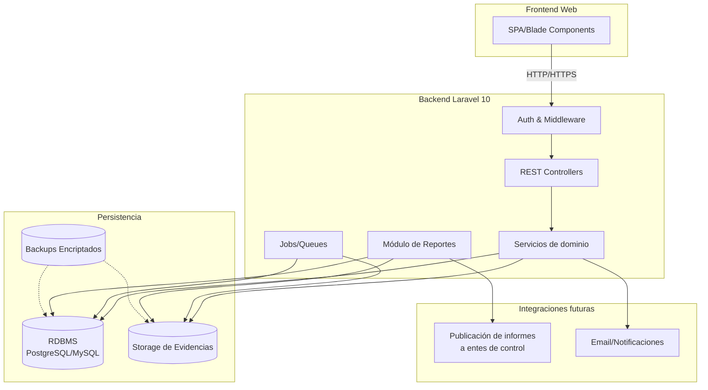
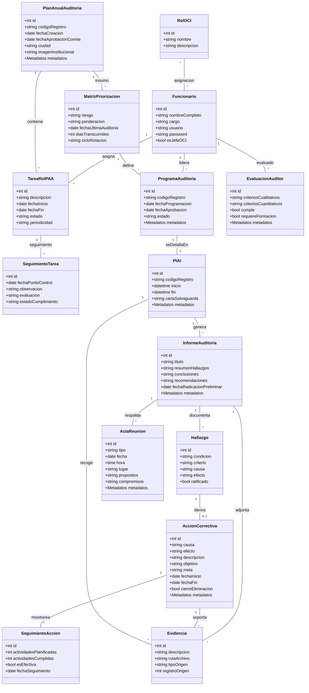

# Documento de Requerimientos del Sistema de Gestión de Auditoría Interna

## Tabla de contenido

- [1. Introducción y Contexto](#1-introducción-y-contexto)
  - [1.1 Objetivo del documento](#11-objetivo-del-documento)
  - [1.2 Alcance organizacional](#12-alcance-organizacional)
  - [1.3 Marco normativo de referencia](#13-marco-normativo-de-referencia)
  - [1.4 Roles clave y stakeholders](#14-roles-clave-y-stakeholders)
- [2. Visión General de la Solución](#2-visión-general-de-la-solución)
  - [2.1 Arquitectura funcional resumida](#21-arquitectura-funcional-resumida)
  - [2.2 Módulos principales](#22-módulos-principales)
  - [2.3 Flujo macro del proceso de auditoría](#23-flujo-macro-del-proceso-de-auditoría)
- [3. Requerimientos Funcionales (RF)](#3-requerimientos-funcionales-rf)
  - [3.1 RF-1: Módulo de parametrización](#31-rf-1-módulo-de-parametrización)
  - [3.2 RF-2: Plan anual de auditoría (PAA) y cumplimiento](#32-rf-2-plan-anual-de-auditoría-paa-y-cumplimiento)
  - [3.3 RF-3: Programa de auditoría interna](#33-rf-3-programa-de-auditoría-interna)
  - [3.4 RF-4: Plan individual y ejecución](#34-rf-4-plan-individual-y-ejecución)
  - [3.5 RF-5: Informes, controversias y acciones correctivas](#35-rf-5-informes-controversias-y-acciones-correctivas)
  - [3.6 RF-6: Competencias y evaluación del auditor](#36-rf-6-competencias-y-evaluación-del-auditor)
  - [3.7 RF-7: Documentación y repositorio](#37-rf-7-documentación-y-repositorio)
- [4. Requisitos de Seguridad, Confidencialidad y Ética](#4-requisitos-de-seguridad-confidencialidad-y-ética)
  - [4.1 Clasificación de protección y acceso](#41-clasificación-de-protección-y-acceso)
  - [4.2 Controles operativos en el flujo de auditoría](#42-controles-operativos-en-el-flujo-de-auditoría)
  - [4.3 Gestión de conflictos de interés y ética](#43-gestión-de-conflictos-de-interés-y-ética)
- [5. Gestión de Metadatos y Trazabilidad](#5-gestión-de-metadatos-y-trazabilidad)
  - [5.1 Principios generales](#51-principios-generales)
  - [5.2 Atributos obligatorios](#52-atributos-obligatorios)
  - [5.3 Aplicación a registros clave](#53-aplicación-a-registros-clave)
  - [5.4 Implicaciones técnicas para Laravel 10](#54-implicaciones-técnicas-para-laravel-10)
- [6. Modelo de Datos y Entidades](#6-modelo-de-datos-y-entidades)
  - [6.1 Consideraciones de modelado](#61-consideraciones-de-modelado)
  - [6.2 Entidades principales y atributos destacados](#62-entidades-principales-y-atributos-destacados)
  - [6.3 Tablas de catálogo y relaciones](#63-tablas-de-catálogo-y-relaciones)
  - [6.4 Diccionario de datos por dominio](#64-diccionario-de-datos-por-dominio)
- [7. Requerimientos No Funcionales (RNF)](#7-requerimientos-no-funcionales-rnf)
- [8. Consideraciones Tecnológicas para Laravel 10](#8-consideraciones-tecnológicas-para-laravel-10)
- [9. Funcionalidades por Rol de Usuario](#9-funcionalidades-por-rol-de-usuario)
- [10. Repositorio Documental y Contenido Obligatorio](#10-repositorio-documental-y-contenido-obligatorio)
- [11. Anexos y Referencias](#11-anexos-y-referencias)

## 1. Introducción y Contexto

### 1.1 Objetivo del documento

Definir de forma estructurada los requerimientos funcionales, no funcionales, de datos y de seguridad para modernizar la herramienta de gestión de auditoría interna (actualmente en Access) mediante una aplicación web desarrollada con Laravel 10.

### 1.2 Alcance organizacional

- Cobija los procesos de la Oficina de Control Interno (OCI) de entidades territoriales y nacionales (Rama Ejecutiva).
- Su alcance funcional es transversal a todos los procesos misionales, estratégicos, de apoyo y de evaluación y mejora de la entidad.
- Aplica a la planeación anual, ejecución de auditorías, seguimiento de hallazgos y acciones correctivas.

### 1.3 Marco normativo de referencia

- **Decreto 648 de 2017:** Define los cinco roles de la OCI, la organización del Comité Institucional de Coordinación de Control Interno y el enfoque de gestión.
- **NTC ISO 19011:2018:** Guías para auditorías de sistemas de gestión.
- **Guía de Auditoría Interna Basada en Riesgos (Función Pública, versión 4 - 2020).**
- **Documentación interna:** Procedimiento PD-GCA-004, manual MA-GCE-003, formatos FR-GCE-XXX y FR-GCA-XXX.

### 1.4 Roles clave y stakeholders

- **Jefe de Control Interno:** Responsable estratégico del programa de auditorías y del cierre de acciones.
- **Equipo auditor / profesional de apoyo:** Ejecuta actividades del PAA, diligencia PIAI, registra hallazgos y seguimientos.
- **Auditado / área auditada:** Presenta controversias, gestiona el plan de mejoramiento.
- **Secretaría de la OCI:** Resguardos documentales, radicación y archivo de evidencias.
- **Entes externos de control:** Reciben reportes y ejercen seguimiento.

## 2. Visión General de la Solución

### 2.1 Arquitectura funcional resumida

- Plataforma web MVC basada en Laravel 10.
- Integración de módulos de parametrización, planeación, ejecución, informes y seguimiento.
- Gestión centralizada de metadatos para los registros de calidad.

### 2.2 Módulos principales

1. **Parametrización y catálogos:** Funcionarios, roles OCI, entes de control, procesos, criterios, alcances, objetivos.
2. **Plan anual de auditoría (PAA):** Gestión de tareas por rol y seguimiento mediante puntos de control con evidencias.
3. **Priorización y programa de auditoría:** Universo de auditoría, matriz de riesgos, programa aprobado.
4. **Plan individual de auditoría (PIAI):** Planificación detallada, bitácora de actividades, control documental.
5. **Informes y controversias:** Informe preliminar, decisiones sobre controversias, informe final.
6. **Acciones correctivas:** Planes de mejora, seguimiento y cierre.
7. **Competencias del auditor:** Evaluación FR-GCA-005 y seguimiento a brechas.
8. **Repositorio documental:** Gestión de guías, procedimientos y formatos auxiliares.

### 2.3 Flujo macro del proceso de auditoría

1. Parametrización inicial de catálogos y roles.
2. Construcción del PAA y asignación de tareas por rol.
3. Priorización del universo auditado y definición del programa.
4. Elaboración del PIAI y ejecución en campo.
5. Generación de informe preliminar, gestión de controversias y emisión del informe final.
6. Registro y seguimiento de acciones correctivas hasta el cierre.
7. Evaluación de competencias del equipo auditor y actualización del repositorio documental.

## 3. Requerimientos Funcionales (RF)

### 3.1 RF-1 Módulo de parametrización


| Código | Descripción                                                                                                                     | Roles involucrados  |
| ------- | -------------------------------------------------------------------------------------------------------------------------------- | ------------------- |
| RF 1.1  | CRUD de funcionarios (Jefe CI, auditores, personal de apoyo), incluyendo usuario y credenciales de acceso.                       | Jefe Auditor, Apoyo |
| RF 1.2  | CRUD de los cinco roles de la OCI definidos en el Decreto 648 de 2017, con posibilidad de actualización si cambia la normativa. | Jefe Auditor, Apoyo |
| RF 1.3  | CRUD de entidades de control externas (Contraloría, Procuraduría, etc.).                                                       | Jefe Auditor, Apoyo |
| RF 1.4  | CRUD de procesos y áreas auditables (estratégicos, misionales, apoyo, evaluación y mejora).                                   | Jefe Auditor, Apoyo |
| RF 1.5  | CRUD de criterios de auditoría (normatividad, legislación, NTC) y alcances aplicables.                                         | Jefe Auditor, Apoyo |
| RF 1.6  | Cargue de imagen institucional y otros parámetros institucionales.                                                              | Jefe Auditor, Apoyo |

### 3.2 RF-2 Plan anual de auditoría (PAA) y cumplimiento


| Código | Descripción                                                                                                                                                      | Roles involucrados  |
| ------- | ----------------------------------------------------------------------------------------------------------------------------------------------------------------- | ------------------- |
| RF 2.1  | Creación de PAA con fecha de elaboración, responsable (Jefe CI) y ciudad/municipio.                                                                             | Jefe Auditor, Apoyo |
| RF 2.2  | Registro de tareas por cada rol OCI, con fechas planificadas y responsable asignado.                                                                              | Jefe Auditor, Apoyo |
| RF 2.3  | Registro de puntos de control por tarea, incluyendo observaciones, estado (realizado, pendiente, anulado), evaluación (bien, mal) y ente de control relacionado. | Jefe Auditor, Apoyo |
| RF 2.4  | Gestión de evidencias asociadas a los puntos de control (carga, descripción, visualización).                                                                   | Jefe Auditor, Apoyo |
| RF 2.5  | Cálculo de porcentaje de avance del PAA y visualización de resumen por rol.                                                                                     | Jefe Auditor        |

### 3.3 RF-3 Programa de auditoría interna


| Código | Descripción                                                                                                                                                                                         | Roles involucrados  |
| ------- | ---------------------------------------------------------------------------------------------------------------------------------------------------------------------------------------------------- | ------------------- |
| RF 3.1  | Matriz de priorización: selección de procesos/áreas, registro de nivel de riesgo, ponderación, requerimientos de comité y entes reguladores, fecha de última auditoría y días transcurridos. | Jefe Auditor, Apoyo |
| RF 3.2  | Determinación automática del ciclo de rotación según la criticidad del riesgo.                                                                                                                   | Jefe Auditor, Apoyo |
| RF 3.3  | Registro del programa de auditoría con objetivos, alcance, criterios, recursos, fechas de inicio/fin y responsable.                                                                                 | Jefe Auditor        |
| RF 3.4  | Validación de correspondencia entre áreas priorizadas y criterios/alcances específicos parametrizados.                                                                                            | Jefe Auditor, Apoyo |
| RF 3.5  | Registro de aprobación del programa por el Comité Institucional de Coordinación de Control Interno.                                                                                               | Jefe Auditor        |
| RF 3.6  | Visualización y exportación del formato del programa (FR-GCA-001).                                                                                                                                 | Jefe Auditor        |

### 3.4 RF-4 Plan individual y ejecución


| Código | Descripción                                                                                                                                            | Roles involucrados  |
| ------- | ------------------------------------------------------------------------------------------------------------------------------------------------------- | ------------------- |
| RF 4.1  | Traslado automático de objetivos, alcance y criterios del programa al PIAI (FR-GCA-002).                                                               | Jefe Auditor, Apoyo |
| RF 4.2  | Registro de actividades del PIAI con fecha, hora de inicio/fin, descripción, auditados y auditores.                                                    | Apoyo, Auditores    |
| RF 4.3  | Registro de reunión de apertura con confirmación de objetivos, alcance, criterios, métodos de muestreo, confidencialidad y canales de comunicación. | Jefe Auditor, Apoyo |
| RF 4.4  | Gestión digital de la Carta de Salvaguarda con adjunto y validación obligatoria.                                                                      | Auditado, Apoyo     |
| RF 4.5  | Registro de hallazgos preliminares durante la ejecución, vinculando evidencia, condición, criterio, causa y efecto.                                   | Auditores           |

### 3.5 RF-5 Informes, controversias y acciones correctivas


| Código | Descripción                                                                                                         | Roles involucrados                |
| ------- | -------------------------------------------------------------------------------------------------------------------- | --------------------------------- |
| RF 5.1  | Generación de informe preliminar y final (FR-GCA-004) con resumen de hallazgos, conclusiones y recomendaciones.     | Auditores, Jefe Auditor           |
| RF 5.2  | Registro de controversias por parte del auditado, con control del plazo (15 días hábiles) y decisión del auditor. | Auditado, Auditores, Jefe Auditor |
| RF 5.3  | Registro de hallazgos ratificados y su asociación al plan de mejoramiento.                                          | Jefe Auditor                      |
| RF 5.4  | Registro de acciones correctivas (FR-GCA-001) con causa, efecto, acción, objetivos, metas, fechas y responsable.    | Auditado, Apoyo                   |
| RF 5.5  | Seguimiento de acciones correctivas (actividades planificadas/cumplidas, efectividad, evidencias) y cierre formal.   | Jefe Auditor, Apoyo               |

### 3.6 RF-6 Competencias y evaluación del auditor


| Código | Descripción                                                                                                               | Roles involucrados     |
| ------- | -------------------------------------------------------------------------------------------------------------------------- | ---------------------- |
| RF 6.1  | Registro de criterios de competencia (educación, experiencia, habilidades, comportamiento) para auditores y líderes.     | Jefe Auditor           |
| RF 6.2  | Gestión del formato FR-GCA-005 para evaluar el desempeño del auditor, incluyendo criterios cualitativos y cuantitativos. | Jefe Auditor, Auditado |
| RF 6.3  | Registro de brechas de competencia y planes de formación o experiencia adicional.                                         | Jefe Auditor           |

### 3.7 RF-7 Documentación y repositorio


| Código | Descripción                                                                                                                                              | Roles involucrados  |
| ------- | --------------------------------------------------------------------------------------------------------------------------------------------------------- | ------------------- |
| RF 7.1  | Acceso a un repositorio documental para cargar, describir y consultar guías, procedimientos y formatos.                                                  | Jefe Auditor        |
| RF 7.2  | Indexación y filtrado por nombre, tipo de documento y versión.                                                                                          | Jefe Auditor, Apoyo |
| RF 7.3  | Visualización en línea o descarga controlada de los documentos de referencia.                                                                           | Jefe Auditor, Apoyo |
| RF 7.4  | Precarga o disponibilidad de documentos obligatorios: Guía de Auditoría Interna Basada en Riesgos, Procedimientos PD-GCA-004, formatos MA-GCE-003, etc. | Jefe Auditor        |

## 4. Requisitos de Seguridad, Confidencialidad y Ética

### 4.1 Clasificación de protección y acceso

- Todos los registros FR-GCE-XXX y FR-GCA-XXX deben clasificarse como **Protección “Controlado”**.
- La ubicación lógica de los registros debe identificarse como **“PC control interno”** (servidor controlado por la OCI, acceso restringido).
- Acceso restringido a usuarios con roles explícitos (Jefe OCI, Auditor Líder, Equipo Auditor, Secretaría, Auditados con permiso limitado).

### 4.2 Controles operativos en el flujo de auditoría

- Confirmación formal de compromisos de confidencialidad durante la reunión de apertura.
- Manejo discreto de información y evidencias durante la ejecución.
- Capacidad del líder de auditoría para restringir observadores si comprometen la independencia.
- Registro de la Carta de Salvaguarda como evidencia de la autenticidad y oportunidad de la información.

### 4.3 Gestión de conflictos de interés y ética

- Registro y aprobación de declaraciones de conflicto de intereses (Anexo B) para auditores.
- Restricción para que un auditor evalúe procesos donde haya tenido responsabilidad previa sin autorización.
- Reglas de negocio que impidan el uso de información para beneficio propio o de terceros.
- Promoción de la objetividad e independencia en los resultados y recomendaciones del informe.

## 5. Gestión de Metadatos y Trazabilidad

### 5.1 Principios generales

- Garantizar la validez probatoria y la integridad de los registros de calidad.
- Integrar metadatos en la capa de persistencia y en la lógica de negocio para todos los formatos oficiales.
- Aplicar de manera uniforme a registros de planeación, ejecución y seguimiento.

### 5.2 Atributos obligatorios

1. Versión del formato (V / Ver).
2. Fecha de aprobación del formato.
3. Medio de almacenamiento: “Medio magnético”.
4. Protección: “Controlado”.
5. Ubicación lógica: “PC control interno”.
6. Método de recuperación: “Por fecha”.
7. Responsable del archivo (Jefe OCI para FR-GCE-XXX, Secretaría para FR-GCA-XXX).
8. Permanencia: “Permanente”.
9. Disposición final: “Backups”.

### 5.3 Aplicación a registros clave

- **Planeación (FR-GCE-XXX):** Plan anual de auditorías (FR-GCE-001), Función de advertencia (FR-GCE-002), Acompañamientos (FR-GCE-003), Registro de posibles actos de corrupción (FR-GCE-004).
- **Ejecución y seguimiento (FR-GCA-XXX):** Programa de auditorías internas (FR-GCA-001), Plan individual (FR-GCA-002), Informe de auditoría (FR-GCA-004), Evaluación del auditor (FR-GCA-005), Acta de reunión (FR-GCA-006), Acciones correctivas y preventivas (FR-GCA-001 – reutilizado).

### 5.4 Implicaciones técnicas para Laravel 10

- Los metadatos deben incluirse en las migraciones y modelos Eloquent de los registros oficiales.
- Establecer eventos de aplicación para capturar automáticamente versión vigente y fecha de aprobación.
- Implementar estrategias de respaldo automatizado según la política “Backups”.
- Incorporar filtros de consulta por fecha para cumplir con el criterio “Recuperación por fecha”.

## 6. Modelo de Datos y Entidades

### 6.1 Consideraciones de modelado

- Mantener integridad referencial entre catálogos, transacciones y evidencias.
- Modelar relaciones uno-a-muchos (PAA → Tareas, Tarea → Seguimientos) y muchos-a-muchos (Programas ↔ Criterios).
- Incorporar claves externas y restricciones de unicidad donde aplique (usuarios, códigos de registro).

### 6.2 Entidades principales y atributos destacados


| Entidad                               | Propósito                                            | Atributos clave                                                                                                                                                                                                      |
| ------------------------------------- | ----------------------------------------------------- | -------------------------------------------------------------------------------------------------------------------------------------------------------------------------------------------------------------------- |
| Usuario / Funcionario                 | Gestiona acceso y responsabilidades del personal OCI. | `funcionario_id`, `nombre_completo`, `cargo_operativo`, `credencial_usuario`, `credencial_password`, asignación de roles OCI.                                                                                       |
| Entidad de control externa            | Parametriza entes reguladores externos.               | `ente_control_id`, `nombre`, indicadores de seguimiento.                                                                                                                                                             |
| Plan anual de auditoría (FR-GCE-001) | Contenedor de la planeación anual.                   | `paa_id`, `codigo_registro`, `fecha_creacion`, `jefe_oci_responsable_fk`, `ciudad_municipio`, `imagen_institucional_path` + metadatos.                                                                               |
| Tarea de rol PAA                      | Registra actividades por rol de la OCI.               | `tarea_id`, `paa_fk`, `rol_oci_fk`, `descripcion_tarea`, `fecha_inicio_planeada`, `fecha_fin_planeada`, `responsable_fk`, `estado_general`.                                                                          |
| Seguimiento de tarea                  | Controla puntos de seguimiento del PAA.               | `seguimiento_id`, `tarea_fk`, `fecha_punto_control`, `observacion`, `estado_cumplimiento`, `evaluacion_tarea`, `ente_control_fk`.                                                                                    |
| Matriz de priorización               | Calcula criticidad y rotación de auditorías.        | `priorizacion_id`, `proceso_area_fk`, `paa_fk`, `riesgos_identificados`, `ponderacion_calculada`, `fecha_ultima_auditoria`, `dias_transcurridos`, `ciclo_rotacion`.                                                  |
| Programa de auditoría (FR-GCA-001)   | Define auditorías aprobadas.                         | `programa_auditoria_id`, `area_auditar_fk`, `fecha_programacion`, `fecha_aprobacion`, `objetivos_programa`, `alcance_programa`, `criterios_aplicados`, `estado_auditoria` + metadatos.                               |
| Plan individual (FR-GCA-002)          | Bitácora detallada de ejecución.                    | `piai_id`, `programa_auditoria_fk`, `objetivos_trasladados`, `fecha_inicio_auditoria`, `fecha_fin_auditoria`, `carta_salvaguarda_path` + metadatos.                                                                  |
| Detalle de actividad PIAI             | Registra actividades específicas.                    | `detalle_actividad_id`, `piai_fk`, `fecha_actividad`, `hora_inicio`, `hora_fin`, `actividad_descripcion`, `nombre_auditados`, `nombre_auditores`.                                                                    |
| Informe de auditoría (FR-GCA-004)    | Consolidación de hallazgos y recomendaciones.        | `informe_id`, `piai_fk`, `titulo_auditoria`, `resumen_hallazgos`, `conclusiones`, `recomendaciones`, `destinatario_legal`, `fecha_radicacion_preliminar` + metadatos.                                                |
| Hallazgo                              | Detalle de hallazgos y controversias.                 | `hallazgo_id`, `informe_fk`, `descripcion_hallazgo`, `condicion_evidencia`, `criterios_aplicados`, `causa`, `consecuencias_efectos`, `hallazgo_ratificado`.                                                          |
| Controversia                          | Gestión de respuestas de auditados.                  | `controversia_id`, `hallazgo_fk`, `descripcion_controversia`, `auditor_decision`, `fecha_presentacion`.                                                                                                              |
| Acción correctiva (FR-GCA-001)       | Plan de mejora derivado de hallazgos.                 | `accion_correctiva_id`, `hallazgo_ratificado_fk`, `causa_mejora`, `accion_a_implementar`, `objetivo_accion`, `meta_descripcion`, `fecha_inicio_accion`, `fecha_fin_accion`, `cierre_eliminacion_causas` + metadatos. |
| Seguimiento de acción                | Medición de avance y efectividad de acciones.        | `seg_accion_id`, `accion_correctiva_fk`, `actividades_planificadas`, `actividades_cumplidas`, `efectividad_accion`, `fecha_seguimiento`, `evidencia_seguimiento_fk`.                                                 |
| Evaluación del auditor (FR-GCA-005)  | Valora competencias del equipo auditor.               | `evaluacion_id`, `auditor_fk`, `evaluador_fk`, `piai_fk`, `criterios_cualitativos`, `criterios_cuantitativos`, `cumplimiento_criterios`, `necesidad_formacion_adicional` + metadatos.                                |
| Acta de reunión (FR-GCA-006)         | Formaliza reuniones de apertura y cierre.             | `acta_id`, `piai_fk`, `tipo_reunion`, `fecha_reunion`, `hora_reunion`, `lugar_reunion`, `asistentes_lista`, `propositos_confirmados`, `compromisos_adquiridos` + metadatos.                                          |
| Documentación de referencia          | Repositorio de guías y procedimientos.               | `documento_ref_id`, `nombre_documento`, `tipo_documento`, `version`, `ruta_archivo`.                                                                                                                                 |
| Evidencia documental                  | Archivos adjuntos vinculados a registros.             | `evidencia_id`, `descripcion_informe`, `ruta_archivo`, `tipo_registro_origen`, `registro_origen_fk`.                                                                                                                 |

### 6.3 Tablas de catálogo y relaciones


| Tabla catálogo              | Descripción                                            | Campos clave                                         |
| ---------------------------- | ------------------------------------------------------- | ---------------------------------------------------- |
| `users` (Laravel)            | Usuarios del sistema.                                   | `id`, `name`, `email`, `password`, `rol_sistema_id`. |
| `cat_roles_ci`               | Roles OCI (5 roles Decreto 648).                        | `id`, `nombre_rol`, `descripcion`.                   |
| `cat_entidades_control`      | Entidades externas de control.                          | `id`, `nombre_entidad`.                              |
| `cat_procesos`               | Procesos estratégicos, misionales, apoyo, evaluación. | `id`, `nombre_proceso`, `tipo_proceso`.              |
| `cat_areas`                  | Áreas auditables por proceso.                          | `id`, `nombre_area`, `proceso_id`.                   |
| `cat_criterios_normatividad` | Normatividad aplicable.                                 | `id`, `descripcion`, `tipo_norma`.                   |
| `cat_alcances_auditoria`     | Alcances predefinidos.                                  | `id`, `descripcion_alcance`.                         |
| `cat_objetivos_programa`     | Objetivos generales del programa.                       | `id`, `descripcion_objetivo`.                        |

Relaciones destacadas:

- `funcionario_rol_oci`: tabla puente (funcionario ↔ rol_oci).
- `asignacion_criterio_area`: asociación entre áreas auditables y criterios/alcances parametrizados.
- `programa_criterios`: relación M:M entre programas de auditoría y criterios.

### 6.4 Diccionario de datos por dominio

#### 6.4.1 Gestión de usuarios y catálogos

- **FUNCIONARIO:** `funcionario_id (PK)`, `nombre_completo`, `cargo_operativo`, `credencial_usuario (Unique)`, `credencial_password`, `rol_jefe_oci (Boolean)`.
- **ROL_OCI:** `rol_oci_id (PK)`, `nombre_rol`, `descripcion`.
- **FUNCIONARIO_ROL_OCI:** `funcionario_rol_id (PK)`, `funcionario_fk (FK)`, `rol_oci_fk (FK)`.
- **ENTIDAD_CONTROL_EXTERNA:** `ente_control_id (PK)`, `nombre`.

#### 6.4.2 Planeación general (PAA)

- **PLAN_ANUAL_AUDITORIA (FR-GCE-001):** `paa_id (PK)`, `codigo_registro`, `fecha_creacion`, `fecha_aprobacion_comite`, `jefe_oci_responsable_fk (FK)`, `ciudad_municipio`, `imagen_institucional_path`, `version_formato`, `fecha_aprobacion_formato`, `medio_almacenamiento`, `proteccion`, `ubicacion`, `metodo_recuperacion`, `permanencia`, `disposicion_final`.
- **TAREA_ROL_PAA:** `tarea_id (PK)`, `paa_fk (FK)`, `rol_oci_fk (FK)`, `descripcion_tarea`, `fecha_inicio_planeada`, `fecha_fin_planeada`, `responsable_fk (FK)`, `estado_general`, `comentarios_periodicidad`.
- **SEGUIMIENTO_TAREA_PAA:** `seguimiento_id (PK)`, `tarea_fk (FK)`, `fecha_punto_control`, `observacion`, `estado_cumplimiento`, `evaluacion_tarea`, `ente_control_fk (FK)`.

#### 6.4.3 Priorización y programación

- **PROCESO_AREA_AUDITABLE:** `proceso_area_id (PK)`, `nombre_area`, `tipo_proceso`.
- **CRITERIO_ALCANCE_PARAM:** `criterio_alcance_id (PK)`, `tipo`, `descripcion`.
- **ASIGNACION_CRITERIO_AREA:** `asignacion_id (PK)`, `proceso_area_fk (FK)`, `criterio_alcance_fk (FK)`.
- **MATRIZ_PRIORIZACION:** `priorizacion_id (PK)`, `proceso_area_fk (FK)`, `paa_fk (FK)`, `riesgos_identificados`, `ponderacion_calculada`, `requerimientos_comite`, `requerimientos_entes_reguladores`, `fecha_ultima_auditoria`, `dias_transcurridos`, `ciclo_rotacion`.
- **PROGRAMA_AUDITORIA_INTERNA (FR-GCA-001):** `programa_auditoria_id (PK)`, `codigo_registro`, `area_auditar_fk (FK)`, `fecha_programacion`, `fecha_aprobacion`, `elaborador_fk (FK)`, `responsable_auditor_fk (FK)`, `estado_auditoria`, `objetivos_programa`, `alcance_programa`, `criterios_aplicados`, `riesgos_programa`, `recursos_programa`, `fecha_inicio_planeada`, `fecha_fin_planeada`, `version_formato`, `fecha_aprobacion_formato`, `medio_almacenamiento`, `proteccion`, `ubicacion`, `metodo_recuperacion`, `permanencia`, `disposicion_final`.

#### 6.4.4 Ejecución (PIAI) e informes

- **PLAN_INDIVIDUAL_AUDITORIA (FR-GCA-002):** `piai_id (PK)`, `codigo_registro`, `programa_auditoria_fk (FK)`, `objetivos_trasladados`, `alcance_trasladado`, `criterios_trasladados`, `fecha_inicio_auditoria`, `hora_inicio_auditoria`, `fecha_fin_auditoria`, `hora_fin_auditoria`, `carta_salvaguarda_path`, `version_formato`, `fecha_aprobacion_formato`, `medio_almacenamiento`, `proteccion`, `ubicacion`, `metodo_recuperacion`, `permanencia`, `disposicion_final`.
- **DETALLE_ACTIVIDAD_PIAI:** `detalle_actividad_id (PK)`, `piai_fk (FK)`, `fecha_actividad`, `hora_inicio`, `hora_fin`, `actividad_descripcion`, `nombre_auditados`, `nombre_auditores`.
- **INFORME_AUDITORIA_INTERNA (FR-GCA-004):** `informe_id (PK)`, `codigo_registro`, `piai_fk (FK)`, `titulo_auditoria`, `resumen_hallazgos`, `conclusiones`, `recomendaciones`, `destinatario_legal`, `fecha_radicacion_preliminar`, `version_formato`, `fecha_aprobacion_formato`, `medio_almacenamiento`, `proteccion`, `ubicacion`, `metodo_recuperacion`, `permanencia`, `disposicion_final`, `responsable_archivo` (Secretaría).
- **HALLAZGO:** `hallazgo_id (PK)`, `informe_fk (FK)`, `descripcion_hallazgo`, `condicion_evidencia`, `criterios_aplicados`, `causa`, `consecuencias_efectos`, `hallazgo_ratificado` (Boolean).
- **CONTROVERSIA:** `controversia_id (PK)`, `hallazgo_fk (FK)`, `descripcion_controversia`, `auditor_decision`, `fecha_presentacion`.

#### 6.4.5 Seguimiento y evaluación

- **ACCION_CORRECTIVA (FR-GCA-001 Seguimiento):** `accion_correctiva_id (PK)`, `codigo_registro`, `hallazgo_ratificado_fk (FK)`, `causa_mejora`, `efecto_mejora`, `accion_a_implementar`, `objetivo_accion`, `meta_descripcion`, `unidad_medida_meta`, `fecha_inicio_accion`, `fecha_fin_accion`, `jefe_oci_seguimiento_fk (FK)`, `cierre_eliminacion_causas` (Boolean), `version_formato`, `fecha_aprobacion_formato`, `medio_almacenamiento`, `proteccion`, `ubicacion`, `metodo_recuperacion`, `permanencia`, `disposicion_final`.
- **SEGUIMIENTO_ACCION_CORRECTIVA:** `seg_accion_id (PK)`, `accion_correctiva_fk (FK)`, `actividades_planificadas`, `actividades_cumplidas`, `efectividad_accion`, `fecha_seguimiento`, `evidencia_seguimiento_fk (FK)`.
- **EVALUACION_DESEMBENO_AUDITOR (FR-GCA-005):** `evaluacion_id (PK)`, `codigo_registro`, `auditor_fk (FK)`, `evaluador_fk (FK)`, `piai_fk (FK)`, `criterios_cualitativos`, `criterios_cuantitativos`, `cumplimiento_criterios` (Boolean), `necesidad_formacion_adicional` (Boolean), `version_formato`, `fecha_aprobacion_formato`, `medio_almacenamiento`, `proteccion`, `ubicacion`, `metodo_recuperacion`, `permanencia`, `disposicion_final`.
- **ACTA_REUNION (FR-GCA-006):** `acta_id (PK)`, `codigo_registro`, `piai_fk (FK)`, `tipo_reunion`, `fecha_reunion`, `hora_reunion`, `lugar_reunion`, `asistentes_lista`, `propositos_confirmados`, `compromisos_adquiridos`, `version_formato`, `fecha_aprobacion_formato`, `medio_almacenamiento`, `proteccion`, `ubicacion`, `metodo_recuperacion`, `permanencia`, `disposicion_final`, `responsable_archivo` (Secretaría).

#### 6.4.6 Documentos y evidencias

- **EVIDENCIA_DOCUMENTO:** `evidencia_id (PK)`, `descripcion_informe`, `ruta_archivo`, `tipo_registro_origen`, `registro_origen_fk`.
- **DOCUMENTACION_REFERENCIA:** `documento_ref_id (PK)`, `nombre_documento`, `tipo_documento`, `version`, `ruta_archivo`.

## 7. Requerimientos No Funcionales (RNF)


| Aspecto        | Requerimiento                                                                                                                   |
| -------------- | ------------------------------------------------------------------------------------------------------------------------------- |
| Usabilidad     | Interfaz intuitiva basada en componentes responsivos (Bootstrap/Tailwind). Flujo similar al aplicativo Access pero modernizado. |
| Rendimiento    | Tiempos de respuesta ágiles en consultas y generación de reportes (PAA, programa, informes).                                  |
| Disponibilidad | Acceso web de alta disponibilidad (hosting nube u on-premise con redundancia).                                                  |
| Seguridad      | Protección CSRF, sanitización de entradas, cifrado de contraseñas (bcrypt/argon2), control de sesiones.                      |
| Auditoría     | Registro de bitácoras para operaciones críticas (creación, edición, cierre de hallazgos y acciones).                        |
| Respaldo       | Estrategia de backups automáticos conforme a la política de “disposición final: Backups”.                                  |
| Escalabilidad  | Base de datos relacional (PostgreSQL o MySQL/MariaDB) con migraciones y seeders para catálogos.                                |
| Documentación | Módulo de ayuda / repositorio con guías, formatos y procedimientos actualizados.                                              |

## 8. Consideraciones Tecnológicas para Laravel 10

- Uso estricto de arquitectura MVC y Eloquent ORM para mapear entidades y relaciones.
- Migraciones y seeders para catálogos: roles OCI, entes de control, criterios, alcances, objetivos.
- Middleware y gates/policies para autorización granular por rol.
- Gestión de archivos mediante `Storage` de Laravel y enlaces simbólicos seguros.
- Generación de reportes PDF/Excel con herramientas como Dompdf, Snappy o Laravel Excel.
- Aplicación de pruebas automatizadas (PHPUnit/Pest) para flujos críticos (PAA, programa, informe, acciones correctivas).

## 9. Funcionalidades por Rol de Usuario


| Rol                                    | Funcionalidades principales                                                                                                                                                                                                                                                 |
| -------------------------------------- | --------------------------------------------------------------------------------------------------------------------------------------------------------------------------------------------------------------------------------------------------------------------------- |
| **Jefe Auditor (Jefe OCI)**            | Administración total de catálogos, creación y aprobación del PAA y programas, revisión de resumen de cumplimiento, decisión sobre controversias, seguimiento y cierre de acciones correctivas, evaluación de competencias, mantenimiento del repositorio documental. |
| **Personal de apoyo / Equipo auditor** | Gestión operativa del PAA (seguimientos, evidencias), diligenciamiento de matriz de priorización, elaboración del PIAI, registro de hallazgos, soporte en informes, seguimiento de acciones correctivas.                                                                 |
| **Auditado / área auditada**          | Consulta de hallazgos, registro de controversias, diligenciamiento de planes de mejora (causa, efecto, acción, metas).                                                                                                                                                     |
| **Secretaría OCI**                    | Control de archivo físico/digital, radicación de informes, carga de evidencias, custodia de actas y formularios.                                                                                                                                                          |

## 10. Repositorio Documental y Contenido Obligatorio

- El repositorio debe permitir:
  - Registro de nombre, descripción, tipo (Guía, Procedimiento, Formato, Herramienta) y versión del documento.
  - Carga y consulta de archivos digitales vinculados.
  - Organización e indexación por filtros para consulta rápida.
- Documentos mínimos:
  - Guía de Auditoría Interna Basada en Riesgos (Versión 4 - julio 2020).
  - Procedimiento de Auditoría Interna PD-GCA-004 y Estatuto de Auditorías Internas.
  - Formatos MA-GCE-003 / FR-GCE-001, FR-GCE-002, FR-GCE-003, FR-GCE-004.
  - Formatos auxiliares (matriz de riesgos, cálculo de muestras, guías de roles OCI, lineamientos para informes).

## 11. Anexos y Referencias

- **Formatos FR-GCE-XXX y FR-GCA-XXX:** Deben conservarse digitalmente con metadatos completos y respaldos.
- **Anexo B – Declaración de conflicto de intereses:** Gestión obligatoria para todos los integrantes del equipo auditor.
- **Código de ética del auditor interno:** Referencia obligatoria para el módulo de competencias.
- **Glosario sugerido:** PAA, PIAI, FR, OCI, Matriz de priorización, Acción correctiva, Controversia, Evidencia.

> Este documento sienta las bases para la configuración técnica y funcional de la solución, permitiendo iteraciones posteriores para casos de uso detallados, reglas de negocio específicas y diseño de interfaces de usuario.

## 12. Diagramas y Flujos de Referencia

### 12.1 Flujo macro del proceso de auditoría

```mermaid
flowchart LR
	A[Parametrización de catálogos
	(Funcionarios, Roles, Procesos, Criterios)] --> B[Construcción Plan Anual de Auditoría (PAA)
	- tareas por rol
	- responsables
	- cronogramas]
	B --> C[Matriz de Priorización
	- valoración de riesgos
	- requerimientos externos
	- cálculo de rotación]
	C --> D[Programa de Auditoría Interna (FR-GCA-001)
	- objetivos
	- alcance
	- criterios]
	D --> E[Plan Individual de Auditoría (FR-GCA-002)
	- bitácora
	- carta de salvaguarda]
	E --> F[Gestión de Hallazgos e Informe (FR-GCA-004)
	- reporte preliminar
	- controversias
	- informe final]
	F --> G[Plan de Mejoramiento (FR-GCA-001)
	- acciones correctivas
	- metas
	- evidencias]
	G --> H[Seguimiento y Cierre
	- evaluación de efectividad
	- cierre formal]
	H --> I[Retroalimentación de Competencias (FR-GCA-005)
	- evaluación del auditor
	- plan de formación]
	I --> J[Repositorio Documental
	- resguardo de informes
	- guías y normativas]
```

### 12.2 Vista de compo****nentes de la solución



### 12.3 Diagrama de entidades principales



## 13. Validaciones y Información Complementaria Pendiente

### 13.1 Catálogos y datos base

- **Catálogos iniciales:** Confirmar procesos institucionales específicos (estratégicos, misionales, apoyo, evaluación/mejora), criterios normativos obligatorios para seeders, alcances predefinidos.
- **Municipios de Colombia:** Validar si se requiere precarga completa de los 1,123 municipios del país o solo municipios del departamento específico.
- **Entes de control:** Confirmar lista completa (Contraloría General, Contralorías Departamentales y Municipales, Procuraduría, CGR, etc.).

### 13.2 Reglas de negocio y cálculos

- **Porcentaje de avance PAA:** Definir fórmula exacta de cálculo (ponderación por rol, peso por criticidad de tarea, peso por entidad de control).
- **Algoritmo de priorización:** Especificar escala de riesgo (bajo, moderado, alto, extremo), fórmula de ponderación matemática, criterios adicionales (impacto financiero, requerimientos urgentes).
- **Ciclos de rotación:** Confirmar matriz de decisión (riesgo extremo = 1 año, alto = 2 años, moderado = 3 años, bajo = no auditar).
- **Plazo de controversias:** Validar si 15 días hábiles es obligatorio o configurable por entidad.

### 13.3 Gestión de evidencias y archivos

- **Límites de almacenamiento:** Definir tamaño máximo por archivo (ej. 50MB), tamaño total por auditoría.
- **Tipos de archivo permitidos:** Especificar extensiones válidas (PDF, Word, Excel, imágenes JPG/PNG, comprimidos ZIP/RAR).
- **Cifrado y seguridad:** Validar si se requiere cifrado en reposo (AES-256) y en tránsito (HTTPS/TLS 1.3).
- **Política de retención:** Confirmar si "permanente" implica retención indefinida o si hay período de migración a archivo histórico.
- **Backup y recuperación:** Definir RTO (Recovery Time Objective) y RPO (Recovery Point Objective) para backups.

### 13.4 Notificaciones y alertas

- **Medios de notificación:** Confirmar si email es suficiente o se requieren notificaciones SMS/WhatsApp Business.
- **Recordatorios automáticos:** Definir días de antelación para vencimiento de tareas PAA, controversias, acciones correctivas.
- **Escalamiento:** Validar flujo de escalamiento si no hay respuesta (ej. recordar a jefe OCI después de 5 días).
- **Dashboard en tiempo real:** Confirmar si se requiere tablero con alertas visuales para vencimientos.

### 13.5 Reportes y exportación

- **Formatos de exportación:** Validar prioridad (PDF primario, Excel secundario, posible CSV para importación).
- **Plantillas de reportes:** Confirmar si se requieren plantillas oficiales con membrete institucional y firmas digitales.
- **Frecuencia de reportes:** Definir si los informes son bajo demanda o programados (mensual, trimestral, semestral).
- **Firmas electrónicas:** Validar integración con certificados digitales para firma de informes (Colombia: CertiCámara, GSE).

### 13.6 Autenticación y autorización

- **Integración con directorio activo:** Confirmar si se requiere LDAP/Active Directory para SSO institucional.
- **Autenticación de dos factores (2FA):** Validar obligatoriedad de 2FA para roles sensibles (Jefe OCI).
- **Gestión de sesiones:** Definir tiempo de inactividad para cierre automático de sesión.
- **Registro de auditoría (audit trail):** Especificar eventos críticos a registrar (login/logout, edición de hallazgos, cierre de acciones).

### 13.7 Accesibilidad y experiencia de usuario

- **WCAG 2.1:** Validar nivel de cumplimiento requerido (A, AA o AAA) para accesibilidad web.
- **Navegadores soportados:** Confirmar compatibilidad (Chrome, Edge, Firefox últimas 2 versiones).
- **Dispositivos móviles:** Validar si se requiere app nativa o PWA (Progressive Web App) para tablets/móviles.
- **Multidioma (i18n):** Confirmar si solo español o si se requiere soporte para comunidades indígenas o inglés para cooperación internacional.

### 13.8 Integraciones externas

- **SIRECI/SUIT:** Validar requisito de integración con Sistema de Rendición Electrónica de Cuentas (Contraloría General).
- **SIGEP II:** Confirmar si se requiere integración con Sistema de Información y Gestión del Empleo Público.
- **Secop II:** Validar necesidad de consulta automática de contratos desde Sistema Electrónico de Contratación Pública.
- **APIs de entes de control:** Confirmar si existe API pública de Contraloría/Procuraduría para envío automático de informes.

### 13.9 Requerimientos de infraestructura

- **Hosting:** Definir si on-premise (servidor local entidad) o nube (AWS, Azure, Google Cloud).
- **Escalabilidad:** Confirmar proyección de crecimiento (usuarios concurrentes, volumen de datos a 5 años).
- **Disponibilidad:** Definir SLA (Service Level Agreement) requerido (99.9% = ~8.76h downtime/año).
- **Disaster recovery:** Validar si se requiere sitio de contingencia en otra ubicación geográfica.

### 13.10 Aspectos de migración desde Access

- **Estrategia de migración:** Definir si migración big bang (un solo momento) o incremental por módulos.
- **Extracción de datos históricos:** Confirmar años de datos a migrar desde Access (últimos 5 años, todo el histórico).
- **Validación de integridad:** Establecer protocolo de validación post-migración (checksums, auditoría de registros).
- **Rollback:** Definir plan B si la migración falla (mantener Access en paralelo durante período de prueba).

### 13.11 Capacitación y gestión del cambio

- **Plan de capacitación:** Definir modalidad (presencial, virtual, videos tutoriales).
- **Usuarios piloto:** Confirmar entidades beta para validación previa al despliegue masivo.
- **Documentación de usuario:** Validar nivel de detalle (manual técnico, guías rápidas, FAQs).
- **Soporte post-implementación:** Definir mesa de ayuda (email, teléfono, chat en vivo) y horarios de atención.

### 13.12 Cumplimiento normativo adicional

- **Ley 1712 de 2014 (Transparencia):** Validar publicación obligatoria de informes en portal web institucional.
- **Ley 1581 de 2012 (Habeas Data):** Confirmar tratamiento de datos personales de funcionarios auditados.
- **Decreto 1080 de 2015:** Verificar alineación con Sistema Integrado de Gestión (MECI, SGC, MIPG).
- **RGPD (si aplica):** Validar si hay cooperación internacional que requiera cumplimiento de GDPR europeo.

> **NOTA CRÍTICA:** Las validaciones 13.1 a 13.12 deben resolverse mediante reuniones de levantamiento de requerimientos con: (1) Jefe de la Oficina de Control Interno, (2) Profesional de Apoyo, (3) Representante del área de TI, (4) Coordinador Jurídico, (5) Contraloría Departamental. Cada aspecto debe documentarse en actas de reunión y anexarse al expediente del proyecto antes de iniciar el diseño técnico detallado.

## 14. Criterios de Aceptación y Validación

### 14.1 Criterios funcionales

- **PAA completo:** El sistema permite crear un PAA con las 5 roles, asignar mínimo 20 tareas totales, registrar seguimientos semestrales y generar resumen de cumplimiento con porcentajes correctos.
- **Priorización basada en riesgos:** La matriz calcula automáticamente la ponderación y ciclo de rotación, validado contra casos de prueba conocidos.
- **Programa de auditoría:** Se genera formato FR-GCA-001 con todas las secciones obligatorias (objetivos, alcance, criterios, fechas, responsables).
- **PIAI y bitácora:** El plan individual traslada correctamente datos del programa y permite registrar actividades con fecha/hora precisa.
- **Gestión de hallazgos:** Los hallazgos soportan condición, criterio, causa, efecto y el flujo de controversia funciona (presentación, aceptación/rechazo).
- **Acciones correctivas:** Solo hallazgos ratificados generan acciones, el seguimiento calcula efectividad y el cierre requiere aprobación del Jefe OCI.
- **Evaluación de auditores:** El formato FR-GCA-005 permite registro de criterios cualitativos/cuantitativos y detección automática de brechas.
- **Repositorio documental:** Se pueden cargar, indexar y descargar guías, procedimientos y formatos de referencia.

### 14.2 Criterios no funcionales

- **Rendimiento:** Cualquier consulta de datos debe responder en <2 segundos, la generación de reportes PDF en <5 segundos.
- **Seguridad:** Todas las contraseñas se almacenan con Argon2id, las sesiones expiran tras 30 minutos de inactividad, CSRF protection habilitado.
- **Disponibilidad:** El sistema debe estar operativo 99.5% del tiempo durante horario laboral (7am-6pm, lunes a viernes).
- **Usabilidad:** Un usuario nuevo debe poder crear una tarea PAA básica en <5 minutos tras capacitación de 30 minutos.
- **Backup:** Backups automáticos diarios a las 2am, con pruebas de restauración trimestrales exitosas.
- **Auditoría:** Todos los cambios en hallazgos, controversias, acciones correctivas y cierres se registran en audit log con timestamp, usuario y acción.

### 14.3 Casos de prueba críticos

1. **CP-001:** Crear PAA completo con 5 roles, 30 tareas, asignar responsables, registrar 60 seguimientos y validar que el resumen de cumplimiento muestre correctamente porcentajes por rol.
2. **CP-002:** Priorizar 34 procesos con diferentes niveles de riesgo, validar que el cálculo de ponderación coincida con hoja de cálculo manual.
3. **CP-003:** Crear programa de auditoría para área ambiental, validar que solo aparezcan criterios/alcances parametrizados para esa área (no permitir criterios contables).
4. **CP-004:** Generar PIAI, registrar 5 actividades (apertura, 3 revisiones, cierre), validar que la carta de salvaguarda sea obligatoria.
5. **CP-005:** Crear informe con 3 hallazgos, auditado presenta 2 controversias, auditor acepta 1 y rechaza 1, validar que solo 2 hallazgos se ratifiquen.
6. **CP-006:** Crear acción correctiva con meta de 10 actividades, realizar 3 seguimientos registrando 3, 6 y 10 actividades cumplidas, validar que muestre progreso incremental.
7. **CP-007:** Intentar acceder como "Auditado" a funciones de "Jefe OCI" (ej. aprobar programa), validar que el sistema deniegue acceso (403 Forbidden).
8. **CP-008:** Cargar evidencia de 45MB en formato PDF, validar que se almacene correctamente y se pueda descargar sin corrupción.
9. **CP-009:** Exportar PAA completo a PDF, validar que contenga imagen institucional, tabla de tareas, seguimientos y firmas de responsables.
10. **CP-010:** Simular caída de base de datos, restaurar último backup, validar que todos los datos se recuperen sin pérdida.

### 14.4 Definición de "Hecho" (Definition of Done)

Una funcionalidad se considera terminada cuando:

1. ✅ **Código completado:** Implementación en Laravel 10 siguiendo PSR-12 y mejores prácticas.
2. ✅ **Pruebas pasadas:** Tests unitarios y de integración ejecutados exitosamente (cobertura >80%).
3. ✅ **Revisión de código:** Code review aprobado por líder técnico.
4. ✅ **Documentación actualizada:** Readme técnico, comentarios en código complejo, diagramas de secuencia si aplica.
5. ✅ **Validación funcional:** Product Owner (Jefe OCI) aprueba la funcionalidad tras demo en ambiente de pruebas.
6. ✅ **Seguridad verificada:** Pruebas de vulnerabilidades (OWASP Top 10) ejecutadas sin hallazgos críticos.
7. ✅ **Migración de datos lista:** Scripts de migración probados con datos reales (mínimo 100 registros).
8. ✅ **Deploy en staging:** Funcionalidad desplegada en ambiente de pre-producción y validada por usuarios beta.

## 15. Glosario de Términos

| Término | Definición |
| --- | --- |
| **PAA** | Plan Anual de Auditoría. Documento estratégico que consolida todas las actividades de los 5 roles de la OCI para una vigencia. |
| **PIAI** | Plan Individual de Auditoría Interna. Bitácora detallada de ejecución de una auditoría específica. |
| **OCI** | Oficina de Control Interno. Órgano de control interno de las entidades públicas definido por Decreto 648 de 2017. |
| **FR-GCE-XXX** | Formatos de Registro - Gestión de Control Estratégico (planeación de roles). |
| **FR-GCA-XXX** | Formatos de Registro - Gestión de Control Auditoría (ejecución de auditorías internas). |
| **Matriz de Priorización** | Herramienta de evaluación de riesgos para determinar qué procesos auditar y con qué frecuencia. |
| **Hallazgo** | Diferencia identificada entre la condición real (evidencia) y el criterio normativo esperado. |
| **Controversia** | Objeción presentada por el auditado ante un hallazgo preliminar del informe de auditoría. |
| **Hallazgo Ratificado** | Hallazgo que, tras análisis de controversias, se confirma como válido y procede a acción correctiva. |
| **Acción Correctiva** | Medida implementada para eliminar la causa raíz de un hallazgo ratificado y prevenir recurrencia. |
| **Carta de Salvaguarda** | Declaración del auditado que certifica la veracidad, integralidad y oportunidad de la información entregada al equipo auditor. |
| **Punto de Control** | Instancia de seguimiento periódico (mensual, trimestral, semestral) de una tarea o acción para verificar cumplimiento. |
| **Ciclo de Rotación** | Frecuencia con la que un proceso debe ser auditado según su nivel de riesgo (ej. proceso crítico: cada año). |
| **Comité ICCCI** | Comité Institucional de Coordinación de Control Interno. Órgano que aprueba el PAA y programa de auditoría. |
| **NTC ISO 19011:2018** | Norma Técnica Colombiana que adopta la norma internacional ISO 19011 sobre directrices para auditoría de sistemas de gestión. |
| **SIRECI** | Sistema de Rendición Electrónica de la Cuenta e Informes. Plataforma de la Contraloría General de la República. |
| **Evidencia Documental** | Archivo digital (PDF, Excel, imagen, video) que soporta un hallazgo, seguimiento o acción correctiva. |
| **Metadatos de Calidad** | Atributos obligatorios de trazabilidad (versión, protección, ubicación, permanencia, etc.) para registros FR-GCE y FR-GCA. |

## 16. Cronograma Estimado de Implementación

### Fase 1: Análisis y Diseño (4 semanas)

- **Semana 1-2:** Levantamiento de requerimientos detallados, resolución de validaciones pendientes (sección 13), definición de casos de uso.
- **Semana 3:** Diseño de arquitectura técnica, diagramas de componentes, modelo de datos definitivo, diseño de interfaces (wireframes).
- **Semana 4:** Definición de plan de migración de datos desde Access, diseño de estrategia de backups, aprobación de arquitectura por comité técnico.

### Fase 2: Desarrollo - Sprint 1 (3 semanas)

- **Módulos:** Autenticación, parametrización de catálogos (funcionarios, roles OCI, entes de control, procesos, áreas).
- **Entregables:** Login funcional, CRUD completo de catálogos, seeders de datos base, middleware de autorización.

### Fase 3: Desarrollo - Sprint 2 (4 semanas)

- **Módulos:** Plan Anual de Auditoría (PAA), gestión de tareas por rol, seguimiento con puntos de control, evidencias.
- **Entregables:** Creación de PAA completo, carga de evidencias, resumen de cumplimiento con cálculo de porcentajes.

### Fase 4: Desarrollo - Sprint 3 (4 semanas)

- **Módulos:** Matriz de priorización, programa de auditoría interna, validación de criterios/alcances por área.
- **Entregables:** Algoritmo de priorización funcional, generación de formato FR-GCA-001, aprobación por comité.

### Fase 5: Desarrollo - Sprint 4 (4 semanas)

- **Módulos:** Plan Individual de Auditoría (PIAI), bitácora de actividades, carta de salvaguarda, gestión de hallazgos.
- **Entregables:** Traslado automático de datos, registro de actividades con fecha/hora, informe preliminar.

### Fase 6: Desarrollo - Sprint 5 (3 semanas)

- **Módulos:** Gestión de controversias, hallazgos ratificados, informe final (FR-GCA-004).
- **Entregables:** Flujo de controversia completo (presentación, decisión), generación de informe definitivo PDF.

### Fase 7: Desarrollo - Sprint 6 (3 semanas)

- **Módulos:** Acciones correctivas, seguimiento de acciones, cierre formal, evaluación de auditores (FR-GCA-005).
- **Entregables:** Plan de mejoramiento, seguimiento con cálculo de efectividad, evaluación de competencias.

### Fase 8: Desarrollo - Sprint 7 (2 semanas)

- **Módulos:** Repositorio documental, actas de reunión (FR-GCA-006), generación de reportes.
- **Entregables:** Carga de guías y procedimientos, gestión de actas, exportación masiva a PDF/Excel.

### Fase 9: Pruebas y QA (3 semanas)

- **Semana 1:** Pruebas unitarias y de integración (cobertura >80%), corrección de bugs críticos.
- **Semana 2:** Pruebas de seguridad (penetration testing, OWASP Top 10), pruebas de carga (100 usuarios concurrentes).
- **Semana 3:** Pruebas de aceptación de usuario (UAT) con Jefe OCI y equipo piloto, ajustes finales.

### Fase 10: Migración de Datos (2 semanas)

- **Semana 1:** Extracción de datos históricos desde Access, transformación a formato compatible, validación de integridad.
- **Semana 2:** Carga en base de datos Laravel, verificación de consistencia, corrección de inconsistencias.

### Fase 11: Capacitación y Despliegue (2 semanas)

- **Semana 1:** Capacitación presencial/virtual (8 horas) para Jefes OCI y personal de apoyo, entrega de manuales.
- **Semana 2:** Despliegue en producción, monitoreo intensivo 24/7, soporte en sitio.

### Fase 12: Estabilización y Cierre (2 semanas)

- **Semana 1:** Corrección de bugs menores detectados en producción, optimización de rendimiento.
- **Semana 2:** Entrega formal del proyecto, transferencia de conocimiento, documentación técnica final, cierre administrativo.

**Duración total estimada:** 36 semanas (~9 meses calendario)

> **NOTA:** Este cronograma asume un equipo de desarrollo de 3-4 personas (1 líder técnico + 2-3 desarrolladores full-stack Laravel), dedicación completa al proyecto. Los tiempos pueden variar según complejidad de validaciones pendientes y disponibilidad de stakeholders para resolución de dudas.

---

**Versión del documento:** 2.0  
**Fecha de actualización:** 15 de octubre de 2025  
**Estado:** Validación pendiente con stakeholders (sección 13)  
**Próxima revisión:** Tras resolución de validaciones y aprobación del cronograma

> Este documento constituye la especificación de requerimientos base para el desarrollo del Sistema de Gestión de Auditoría Interna en Laravel 10. Cualquier cambio posterior debe seguir el proceso de gestión de cambios del proyecto y ser aprobado por el Comité de Control Interno.
